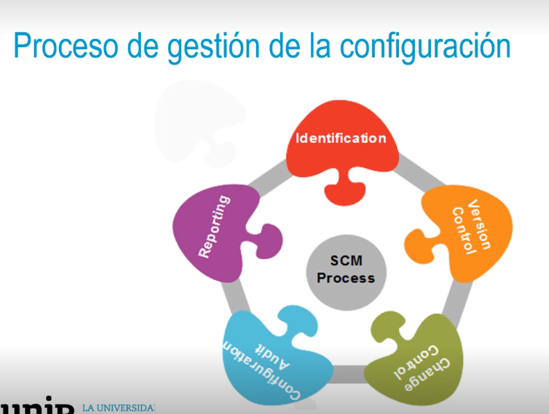
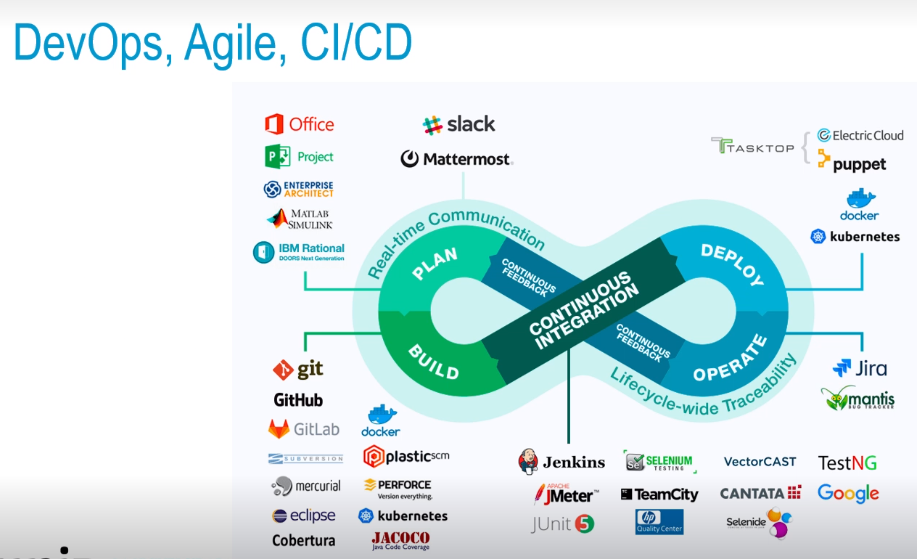
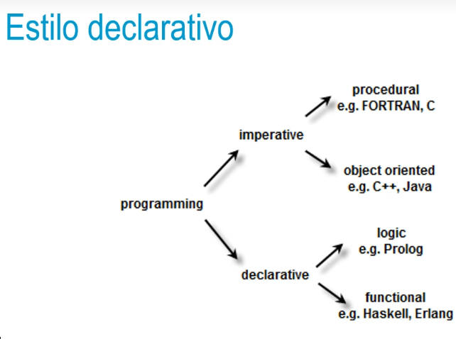
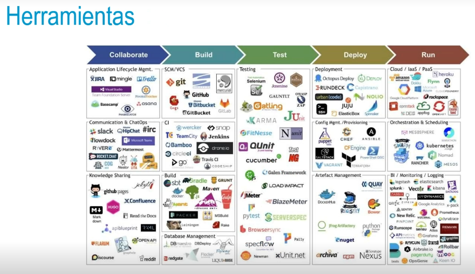

- ¿Qué son los SGC?
  • Definición: es un proceso.
  • Origen: US Army.
  • Estándares:
  • ISO 20000:1 2011& 2018 Service Management System.
  • ITIL Service Asset and Configuration Management.
  • Beneficios:
  • Escalado más sencillo.
  • Disaster recovery.
  • Uptime.
- 
-
- {:height 482, :width 778}
-
- 
-
-
- 
-