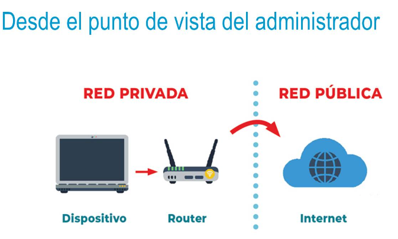
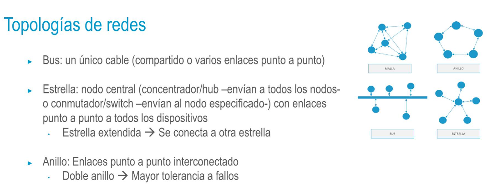
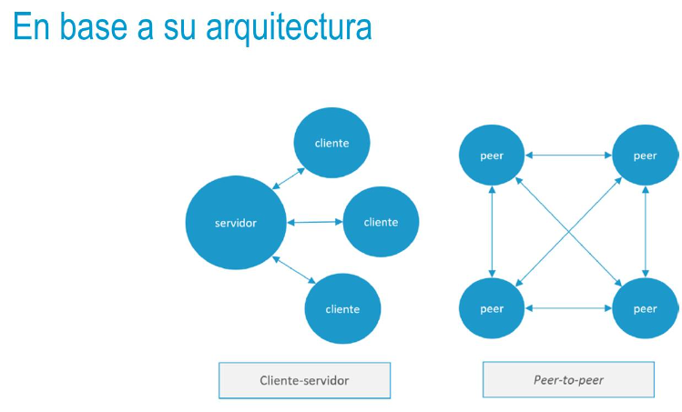
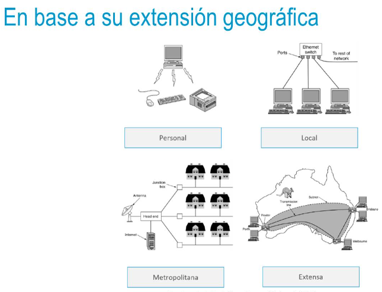

- 
- ## Topologías de redes
  • Representación de los elementos de una red y cómo están conectados
  • Topología física
  • Disposición física real detallando todos los componentes: cableado,
  equipos finales, equipos de interconexión, etc.
  • Topología lógica
  Representación conceptual donde lo principal es mostrar los equipos
  y el flujo de información
  • Es más común utilizar la topología lógica (salvo que necesitemos
  especificar detalles físicos)
- 
- • Arbol: estructura jerárquica con enlaces punto a punto entre nodos
  • Malla: conexiones punto a punto entre algunos o todos los nodos de
  una red (malla completa)
  • Mayor tolerancia a fallos
  • Mayor complejidad
  • Malla completa de N elementos → N*(N-1)/2 enlaces punto a punto
- 
- 
- [[1.3 Definicion de DevSecOps]]