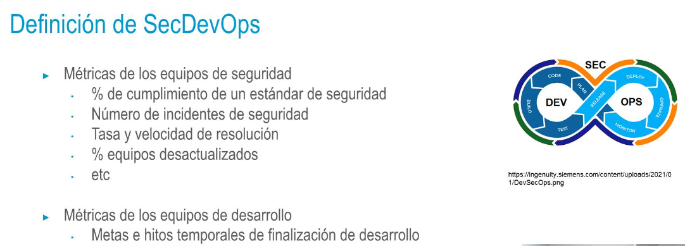

- 
-
- 
- 
- 
- • Integración entre
  • Desarrolladores
  • Operadores
  • Ingenieros de seguridad
  • La seguridad es un servicio más de la cadena de requisitos del cliente
  • Los ingenieros de seguridad añaden controles sobre el producto
  entregable
  El objetivo, al igual que en las metodologías ágiles, debe ser que el equipo pase de defender sus
  propias métricas a defender el resultado de toda la organización
-