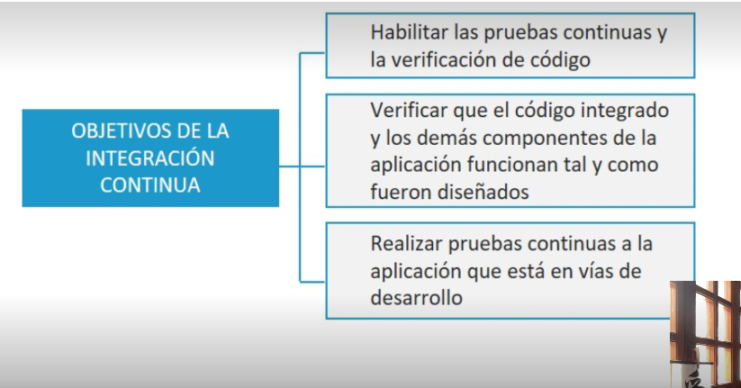

- • Existen una serie de principios básicos que definen toda estrategia exitosa para implementar DEvops:
- • Planificación y medición.
  • Desarrollo y pruebas.
  • Lanzamientos y despliegues continuos.
  • Supervisión y optimización.
  Todo esto, contribuyendo a un mayor grado de
  madurez en el desarrollo de software
- 
-