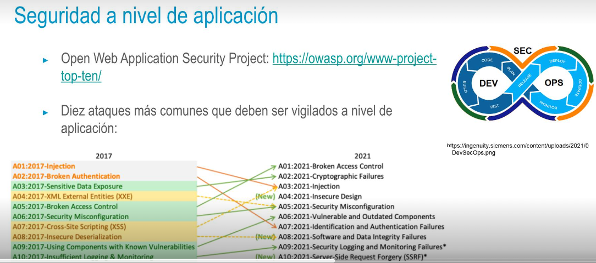

## Áreas de Seguridad en DevOps
• Seguridad basada en pruebas (test-driven security)
• Implementar y probar controles de seguridad automáticos en el pipeline DevOps
• Monitorizar y responder a los ataques
• Preparar a la organización para actuar en situaciones de ataque, monitorizando y planteando 
   sistemas de respuesta a las amenazas
• Evaluar riesgos y madurar la seguridad. Se centra en la operativa de alto nivel. La seguridad no es 
   sólo un aspecto tecnológico, sino también estratégico para la organización.
- ## Seguridad basada en pruebas
  • Controles básicos que impidan vulnerabilidades "débiles / fáciles"
  • Inicio de sesión root deshabilitado
  • Sistemas actualizados a la última versión
  • HTTP → redirección a HTTPS
  • Credenciales no hardcodeados en código de la aplicación
  • Nivel de administración detrás de VPN
  • Lista de controles consensuada entre equipo de seguridad, desarrollo y operaciones
- 
-
- ## Seguridad a nivel de infraestructura
  • El hecho de utilizar una nube pública no exime de aplicar políticas de seguridad sobre la infraestructura
  • Los proveedores de nube proporcionan herramientas y servicios que el cliente ha de mantener, configurar y adaptar a sus propias políticas de seguridad
  • Por ejemplo, de nada sirve que el proveedor de nube nos proporcione un servicio de firewall si nosotros, como clientes, no configuramos dicho firewall de manera que cumpla nuestros requisitos de seguridad
- ## Seguridad del pipeline
  • Despliegue de productos basado en automatización → Proceso muy diferente al despliegue  
      tradicional
  • Pipelines CI/CD es un punto vital a proteger en un sistema, puesto que desde él podemos acceder al 
     código de producción
  • Controles de integridad de los commits
  • Acceso basado en roles en las herramientas de CI/CD