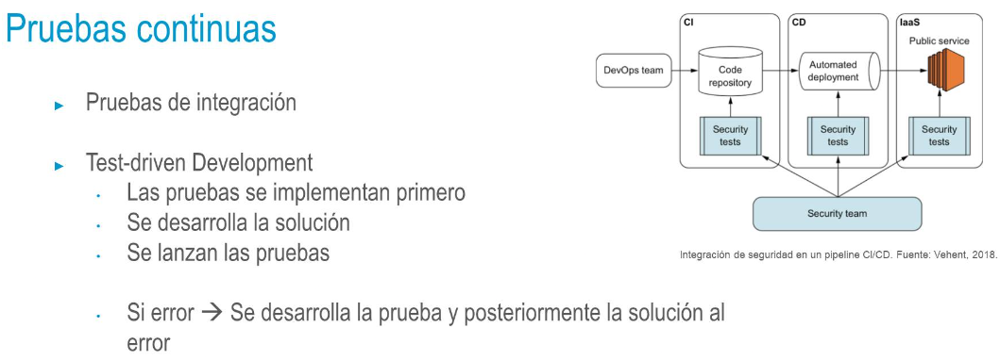
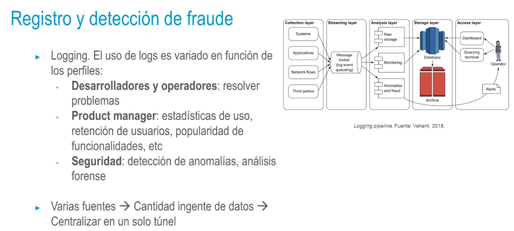
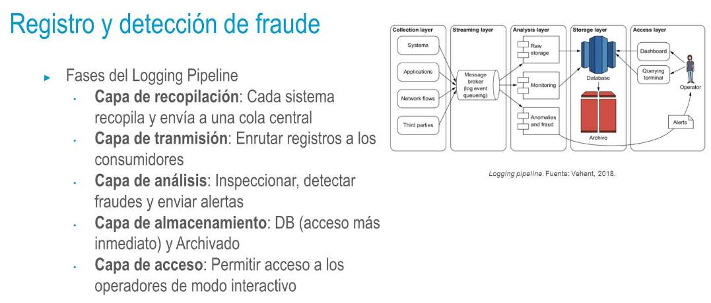

- 
- ## Pruebas continuas
  DevOps
  • Ventajas:
  • El diseño de las pruebas previo hace que el ingeniero de seguridad se involucre con el producto a 
     priori (y no a posteriori tras su finalización para hacer meras comprobaciones)
  • Las pruebas son concretas y comprueban un comportamiento deseado completo. No son
     generalidades
  • Al igual que en el desarrollo, la reutilización es aplicable a las pruebas
- • La experiencia es clave en el desarrollo de las pruebas, por lo que los ingenieros de seguridad 
     podrán aportar su experiencia al resto del equipo DevOps
  • La seguridad se debe incorporar como otra característica más del producto que ha de ser 
     comprobada con laspruebas
- ## Monitorización y respuesta a ataques
  • Poseer un servicio público en Internet es asumir que ese servicio en algún momento va a ser 
     atacado.
  • Hay múltiples maneras:
  • Búsqueda de credenciales de usuario
  • Interrupción del servicio
  • Rescates por compromiso de datos o del propio negocio
  • Explotar vulnerabilidades en la infraestructura para acceder a los datos
- 
-
- 