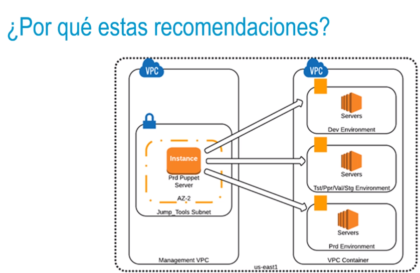
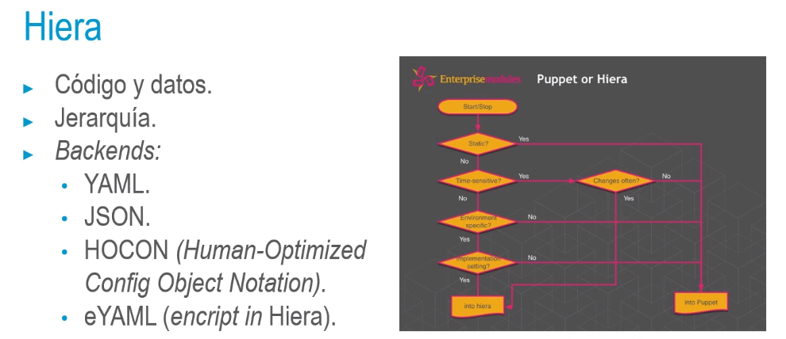

- ¿Por qué estas recomendaciones?
  • Entornos.
  • Datos y código.
  • Buenas prácticas con el código.
  • Diseño de módulos.
  • DSL.
  • Idempotencia.
  • Stateless.
- 
- Tips
  • Control de versiones.
  • Dry runs (mitigar los efectos del fallo).
  • Librarian-puppet.
  • Hiera (separar datos de código): https://www.puppet.com/docs/puppet/7/hiera.html
  • Uso de módulos.
- Datos de código
  • Categorías:
  • Lógica de aplicación.
  • Lógica de negocio.
  • Datos específicos de un site.
  • Datos específicos de un servicio.
  • Datos específicos de un nodo.
- • Simplicidad.
  • Responsabilidad única.
  • Intereses.
  • Orientado a la interface.
  • Optimizar el esfuerzo.
- {:height 344, :width 778}
-