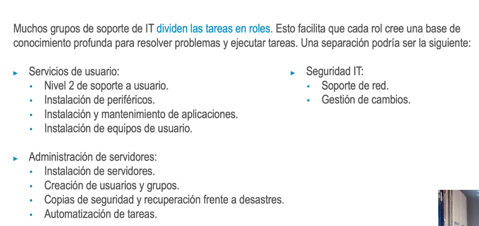
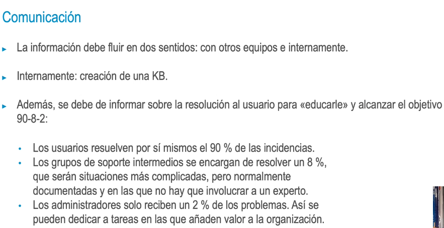
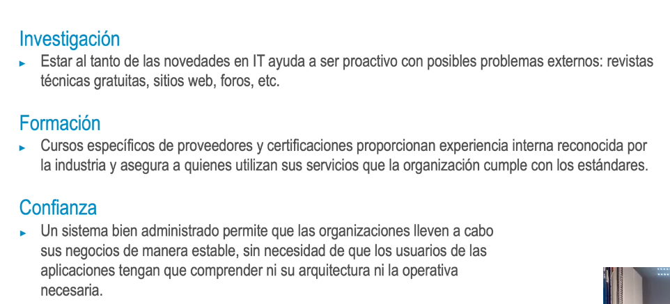

- Cada organización define roles y responsabilidades, pero hay algunas tareas comunes:
  • Instalación de servidores y clientes.
  • Instalación y mantenimiento de aplicaciones.
  • Creación de usuarios y grupos.
  • Soporte a usuarios.
  • Copias de seguridad y recuperación frente a desastres.
  • Seguridad.
  • Automatización de tareas.
  • Instalación de periféricos como impresoras.
  • Gestión de cambios.
  • Configuración de equipos de red local.
- 
- Operaciones
  • En departamentos grandes y maduros, los procedimientos y los mecanismos están bien establecidos
  e integrados en aplicaciones de soporte; hablamos de gestión de cambios, control de configuración,
  inventario, catálogo de servicios, gestión de incidencias, etc.
  • En departamentos pequeños el nivel de madurez no suele ser homogénea y, en estos casos, el
  administrador puede usar una lista diaria o semanal para gestionar sus tareas, además de
  coordinarse con otros equipos para asegurarse de que todos los sistemas funcionan correctamente.
- 
- 
-
-