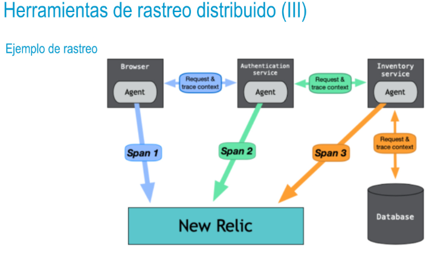

- Herramientas de rastreo distribuido (I)
  • Las herramientas de rastreo distribuido permiten dar seguimiento a una búsqueda en los logs a través de un sistema de software distribuido en múltiples aplicaciones, servicios y bases de datos, así como capas intermedias y otras piezas de software. Esto permite profundizar en detalle sobre todo lo que sucede dentro de un sistema software.
  • Estas herramientas ofrecen representaciones gráficas que muestran cuánto tiempo ha tardado una
  solicitud en un paso determinado. De esta forma, el usuario puede determinar dónde está el problema
  que hace que el sistema experimente latencias o bloqueos.
- Herramientas de rastreo distribuido (II)
  API OpenTracing
  • OpenTracing es una especificación que surgió de Zipkin con el objetivo de proveer compatibilidad
  multiplataforma. Ofrece un proveedor neutro a nivel de API para agregar rastreo a las aplicaciones e
  integrar esos datos en sistemas de rastreo distribuido.
  • Zipkin, Jaeger y AppDash son ejemplos de herramientas de código abierto que han adoptado esta
  especificación, pero incluso herramientas propietarias como Datadog e Instana también lo están
  haciendo.
- 
-