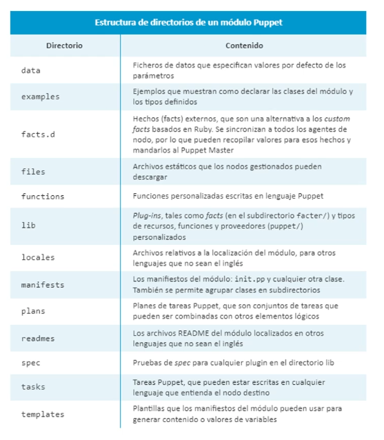

### Modulos
- Un modulo en Puppet se refiere a una collecion reutilizble de manifiestos, recursos, archivos, plantillas, classes y definiciones.
- Consta de una estructura de directorios concreta y el archvio principal init.pp.
- Puppet revisara los directorios que se hayan especificado mediante las rutas y modulos. Estas rutas de modulos se configuran en el fichero puppet.conf mediante la opcion de configuracion modulepath dentro de la seccion [main].
- > [main]
	- > /var/lib/puppet/modules:/opt/modules
		- > moduledir = /etc/puppet/modules:
- • Ej.: creación del módulo sudo y el directorio manifest donde se encuentra el init. pp.
  El archivo init.pp es el núcleo del módulo y define la clase principal a la que nos
  referiremos al utilizar el nombre del módulo directamente. El directorio files almacenará
  cualquier archivo que necesitemos utilizar como parte de nuestro módulo, mientras que el
  directorio templates contendrá cualquier plantilla que requiera nuestro módulo
- > mkdir -p /etc/puppet/modules/sudo/{files, templates, manitests)
	- > touch /etc/puppet/modules/sudo/manifests/init.pp
	- 
	- Atributo source: ruta del fichero origen que queremos
	  enviar al cliente.
	  >  puppet:// → indica el protocolo.
	  > $servidorpuppet → variable definida en el fichero site.pp.
	- modules/sudo/etc/sudoers → indica la ubicación del archivo sudoers dentro del servidor,
	  similar a la ruta de acceso a un recurso compartido en un servidor de ficheros de red. Los
	  ficheros se almacenan siempre en el subdirectorio files con lo que no hay que incluirlo en la ruta.
-
- > class sudo {
  package {sudo:
  ensure = present,
  }
  if $operatingsystem == "Ubuntu" {
  package {"sudo-ldap" :
  ensure = present,
  require => Package ["sudo"],
  }
  file {"/etc/sudoers":
  owner =>"root",
  group =>"root",
  mode => 0440,
  source =>"puppet: / /$servidorpuppet/modules/sudo/etc/sudoers",
  require => Package["sudo"],