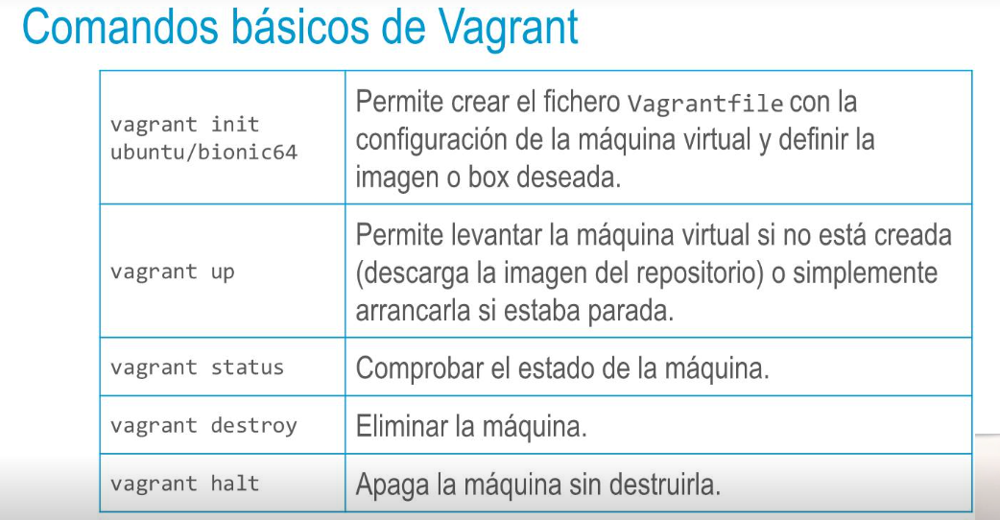
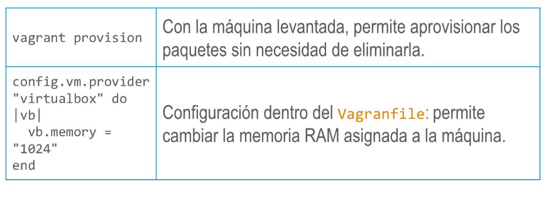
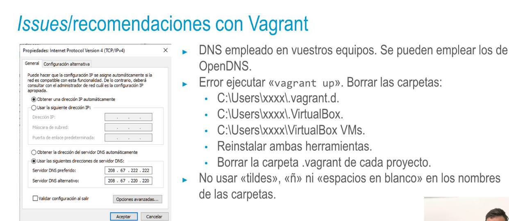

## Vagrant
• Para evitar utilizar nuestras máquinas, lo más recomendable es tener un entorno aislado aparte
donde no tenga importancia si se han cometido errores o la configuración no funciona como se
espera.
También facilita el «resetear» limpiamente el entorno y volver a empezar.
Emplearemos para ello máquinas virtuales (VM) con el entorno de virtualización de VirtualBox y la
herramienta Vagrant para automatizar la gestión de las máquinas.
- ### Vagrant y Oracle VirtualBox
  • La herramienta VirtualBox de Oracle es gratuita. Permite crear una máquina virtual e instalar en ella
  cualquier sistema operativo de la misma manera que se haría en una máquina física. Se puede usar
  VirtualBox como software independiente, pero es recomendable combinarlo con Vagrant.
  • Vagrant permite gestionar y automatizar todo conjuntamente.
  • Vagrant permite definir todo programáticamente y poder así ejecutarlo de manera automatizada. Esta configuración puede luego ser guardada en el repositorio junto con tu código y, cuando cambie, todos los miembros del equipo tendrán la última versión la próxima vez que se actualicen contra el
  repositorio.
- 
-
- 
- 
-
-