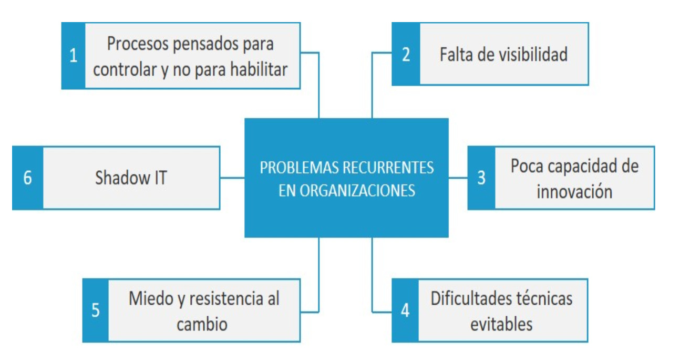

- Factores que pueden acelerar la adopción de DevOps
  • Tras la creación del ambiente correcto y una buena predisposicion para el cambio, podremos
  centrarnos en los retos tecnológicos que require la adopción de DevOps, pero es habitual que exista
  fricción derivada en la mayoria de los casos de la propia naturaleza humana.
- 
-