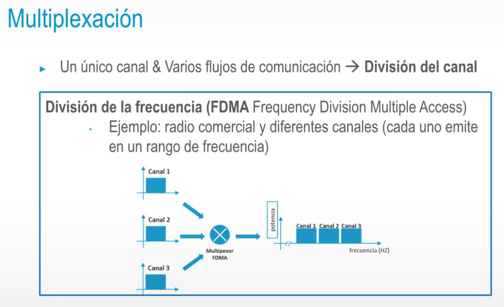
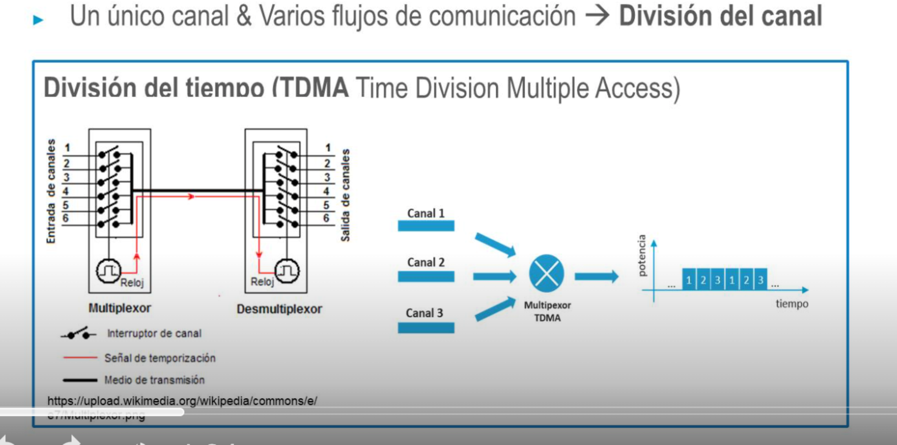

- 
-
-
-
-
- 
- • Un único canal & Varios flujos de comunicación → División del canal
  División de código(CDMA Code Division Multiple Access)
  • Código XOR Datos
  • 3G
- ## Conmutación
  • Comunicación entre dispositivos que no están conectados directamente
  Origen → [Nodos de interconexión]* → Destino
  • Dos tipos
  • Sin conexión: no enlace previo. Confirmación de recepción opcional
  • Orientado a la conexión: se establece circuito antes de la
  transmisión. Los datos se envían a través de ese circuito. Los
  circuitos se pueden reutilizar en diferentes transmisiones
- ## Conmutación :: De circuitos
  • Se establece un canal exclusivo → no se permiten otros datos en ese
  mismo circuito
  • El canal se especifica antes de la transmisión
  • La transmisión ocurre siempre por ese canal
  •Al finalizar la transmisión el canal puede:
  • Persistir en el tiempo (para futuros usos)
  • Cerrarse compartido durante
- ## Conmutación :: De paquetes
  • Cada unidad de transmisión se divide en paquetes de menor tamaño
  • Cada paquete tiene cabeceras con información sobre destino, control de errores, etc
  • Cada paquete se transmite de manera independiente al resto
  Se utilizan todos los recursos disponibles de una red para la transmisión de todos los paquetes posibles
  • Las redes IP son redes de conmutación de paquetes con un cierto "contral de prioridad" /nueden variar las prinridados de determinados paquetes)
- ## Conmutación :: De mensajes
  • Intermedio entre circuitos y paquetes
  • Ruta exclusiva
  • Cuando un mensaje llega a un nodo de interconexión (intermedio), se almacena hasta que el siguiente nodo de interconexión está disponible
  • No resuelve el problema del uso de todos los recursos de una red y sin embargo, introduce problemas de almacenamiento de mensajes, latencia, retardos, etc
-