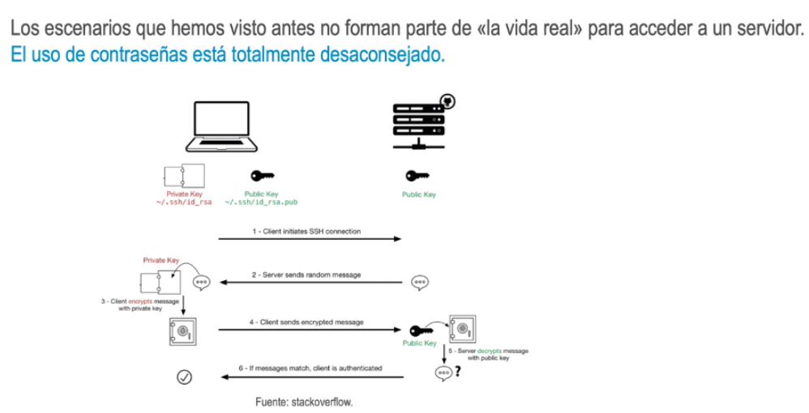

- 
-
- Generación de claves
  Opción 1. Generar una pareja de claves y copiar la clave pública en los servidores
  • Normalmente los proveedores de nube tienen esa opción.
  • El usuario deberá guardar la clave privada y proporcionarla al cliente de SSH en cada
  conexión.
  ssh -i key.pem ec2-user@34.123.123.123
  -i: para que la conexión mire en el fichero de claves a la hora de hacer
  la autenticación.
- Generación de claves
  Opción 2. Generar la pareja de claves localmente y copiar la clave pública a los servidores por
  algún otro método o proporcionarla al proveedor de nube antes de arrancar las instancias
  • Se puede generar la pareja de claves en una maquina Linux:
  ssh-keygen -t rsa -b 4096 -f./security_key
  -t: algoritmo a utilizer.
  -b: tamaño (complejidad) de la clave.
  -f: fichero en el que se va a almacenar la clave.
  • La clave pública se guardará en el fichero security_key-pub y la clave
  privada en security_key. Por defecto, las rutas serían ~/.ssh/id_rsa.pub
  V~/ ssh/id rsa.l