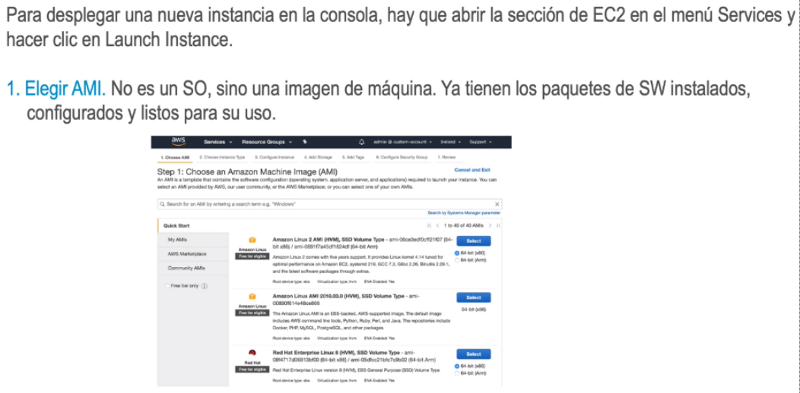
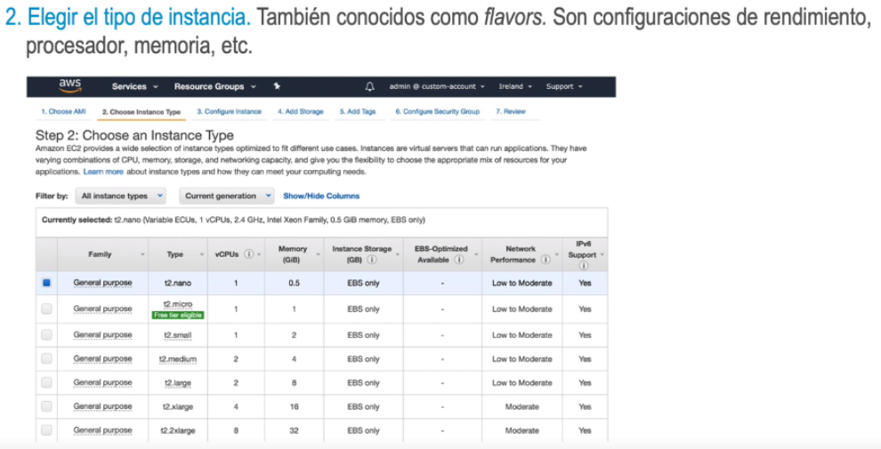
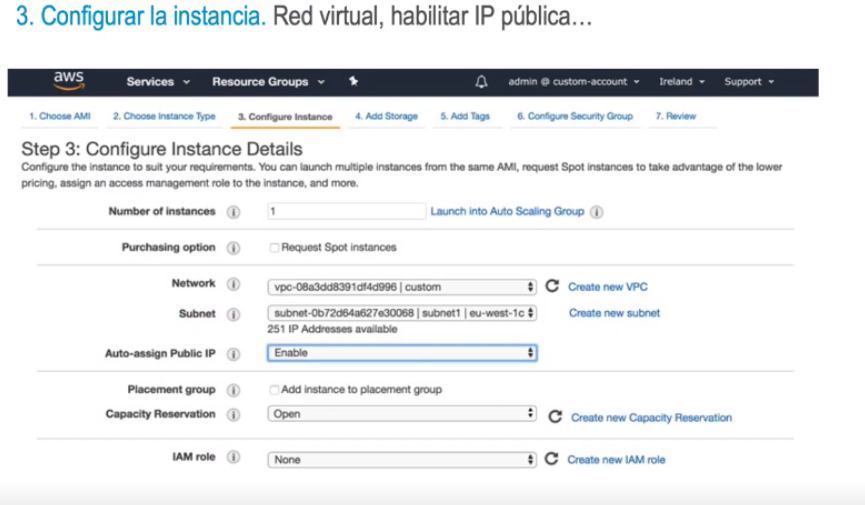
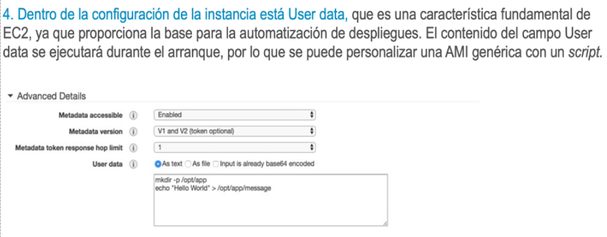
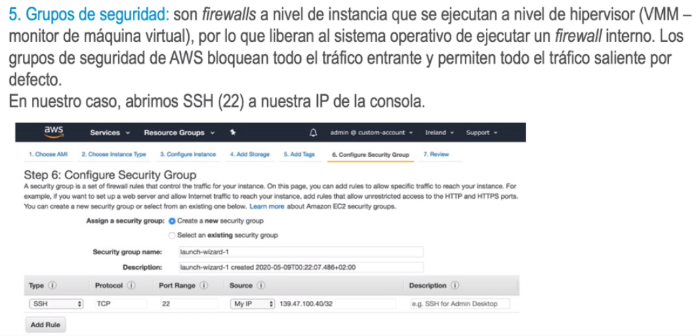
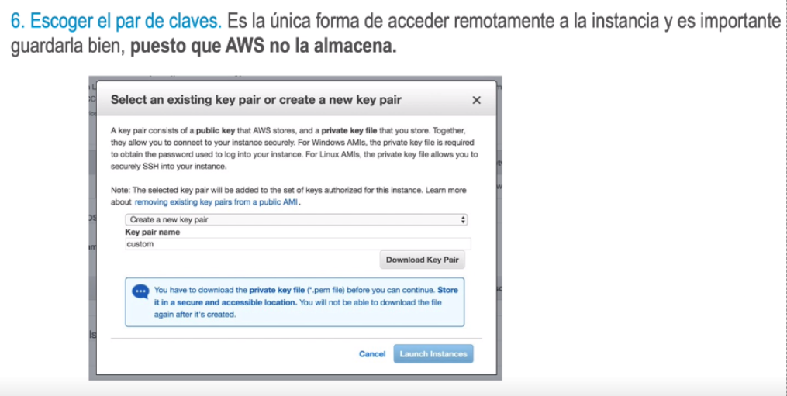
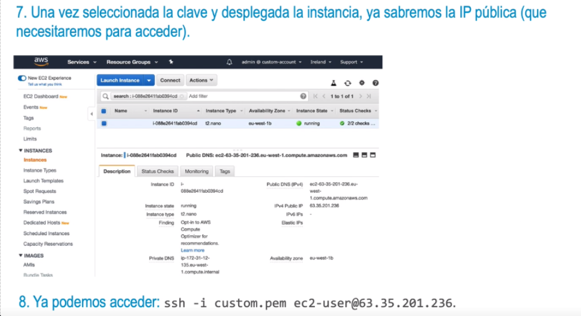

- • Los servidores en la nube no se instalan, se despliegan.
  • En general, dejaremos hablar de «un servidor» para hablar de instancias.
  • Para arrancar instancias podemos utilizar la consola web, una herramienta de línea de
  comandos o una aplicación propia que use un SDK del proveedor (kit de desarrollo de SW).
  • EC2, o Elastic Compute Cloud, permite que los usuarios alquilen recursos de computación por
  segundos a partir de máquinas virtuales en varios sistemas operativos.
- 
- 
-
- 
-
-
-
- 
-
-
- 
-
- 
-
- 
-