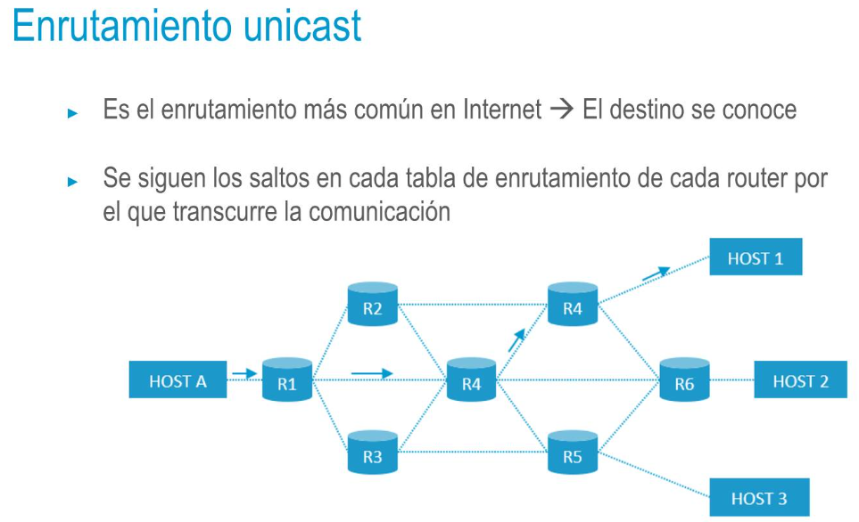
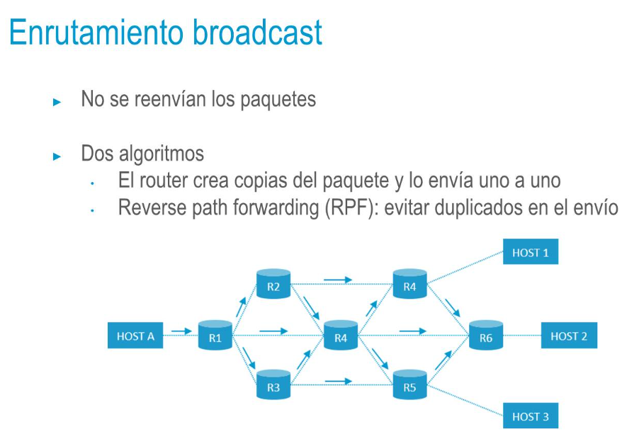
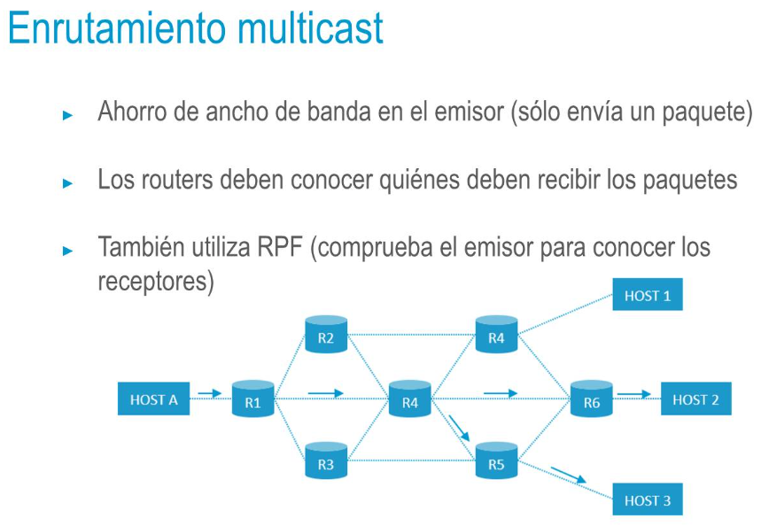
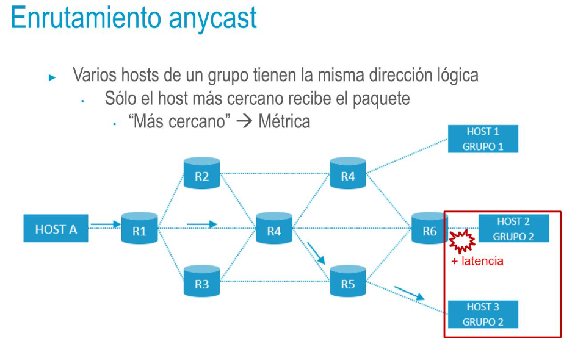

## Direcciones de red
• **Unicast**: destinada a un host concreto
• **Multicast**: destinada a un grupo de dispositivos
     • Transmisiones de audio/vídeo a varios dispositivos → Router
        duplica el flujo para que llegue a todos los destinos. Si fuese
        unicast, sería el host quien tendría que enviar N flujos
• **Broadcast:** destinada a todos los hosts de la red
• Un router nunca reenvía tráfico de broadcast (puesto que ésta se
limita a la red local)
• ARP → MAC <> IP
**Anycast:** destinada al host más cercano de un grupo
- 
- 
- 
- 
-