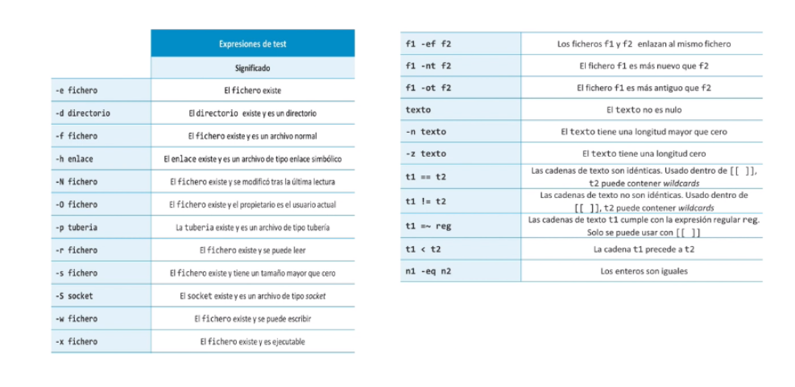
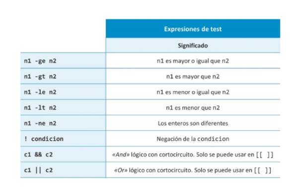
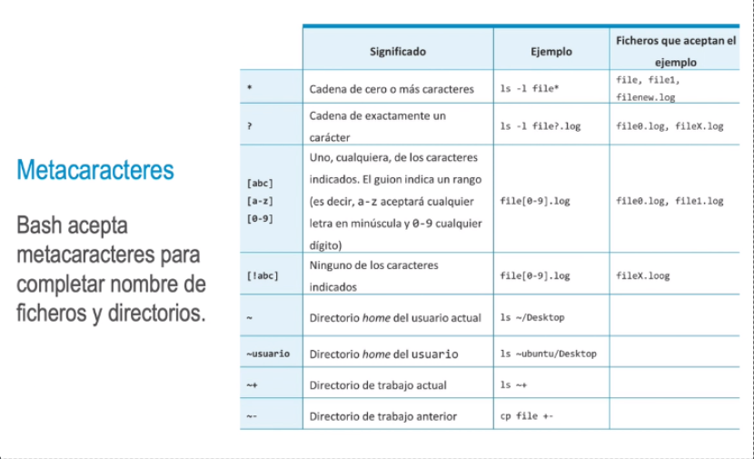
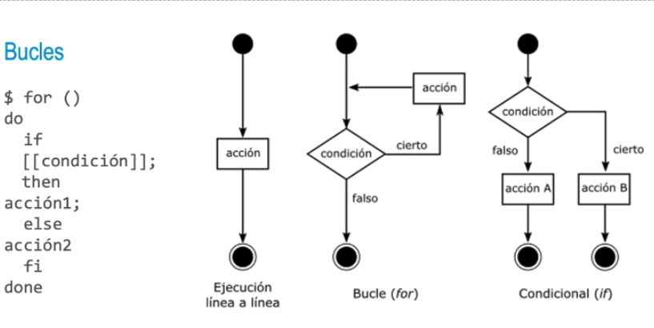

### Heredocs
Son bloques de código que usan la redirección para alimentar un conjunto de líneas o comandos a un
programa externo.
Se usa fundamentalmente para insertar ficheros externos o de configuración en el propio del script
«IDENTIFICADOR_HEREDOC
IDENTIFICADOR_ HEREDOC
Ventajas: se puede transmitir grandes cadenas de una forma sencilla, respetando la identación, espacios,
saltos de línea, caracteres especiales, etc.
- ### Expresiones Logicas
- • test: evalúa una condición lógica y devuelve 0 si es verdadera y 1 si es falsa. Tambien se usa
  [condición ] y [[ condición ]].
  > $ test 1 -eq 2; echo $?
  > 1
  > 0
  > $ [[ 1 -eq 1 ]]; echo $?
- • if: para construir bloques condicionales. Termina con fi y se complementa con else.
  > $ if [[ 1 -eq 1 ]] ; then
  > echo igual
  > else
  > echo diferente
  > fi
- {:height 266, :width 530}
-
- 
-
-
- {:height 481, :width 778}
-
- #### Expansión
  Se conoce como brace expansion. En este caso, se utilizan únicamente para texto (recordemos que los
  metacaracteres se usan solo para nombres de archivos). Las palabras generadas en una expansión no
  tienen por qué coincidir con ficheros.
  $ echo Rule{A1, A2,A3, B1, C1, C2}
  RuleA1 RuleA2 RuleA3 RuleB1 RuleC1 RuleC2
  $ echo Rule{1..5}
  Rule1 Rule2 Rule3 Rule4 Rule5
-
- 
-