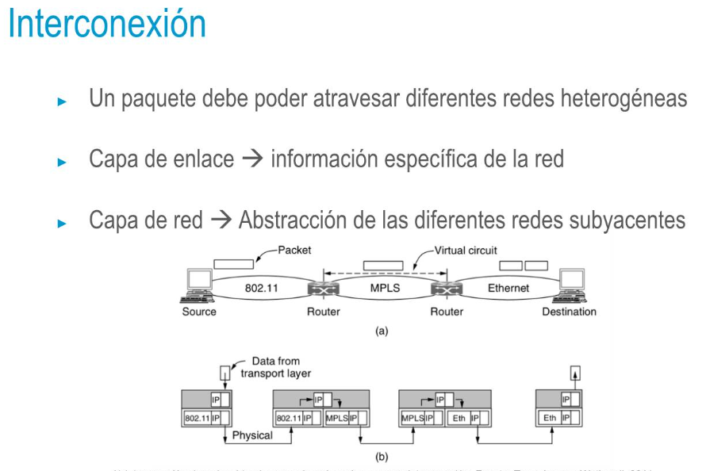
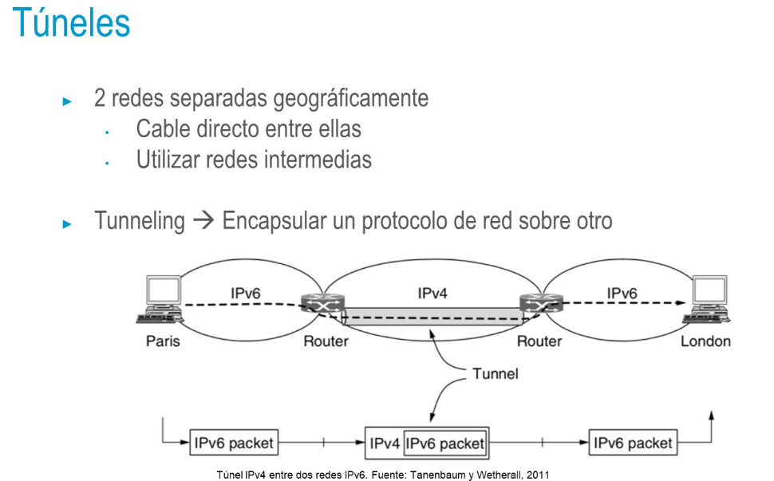

- 
- 
- ## Fragmentación de paquetes
  • Maximum Transmission Unit (MTU) i En Ethernet 1500 bytes
  • Si el tamaño del paquete es mayor que el MTU
  • Dividirlo en diferentes paquetes que se enviarán de manera independiente
  • Cada paquete llevará la misma cabecera (misma dirección de origen, dirección de destino, etc)
- • DF (do not fragment) → Evitar que los nodos intermedios lo fragmenten Mayor número de paquetes → Mayor carga en la red
  • Si los paquetes son demasiado grandes → Se pueden perder debido a que un nodo intermedio no lo pueda procesar