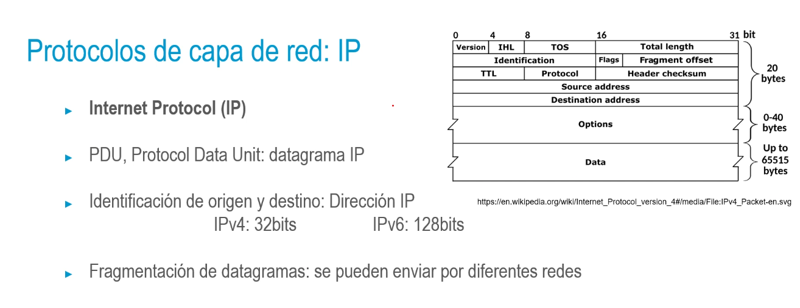
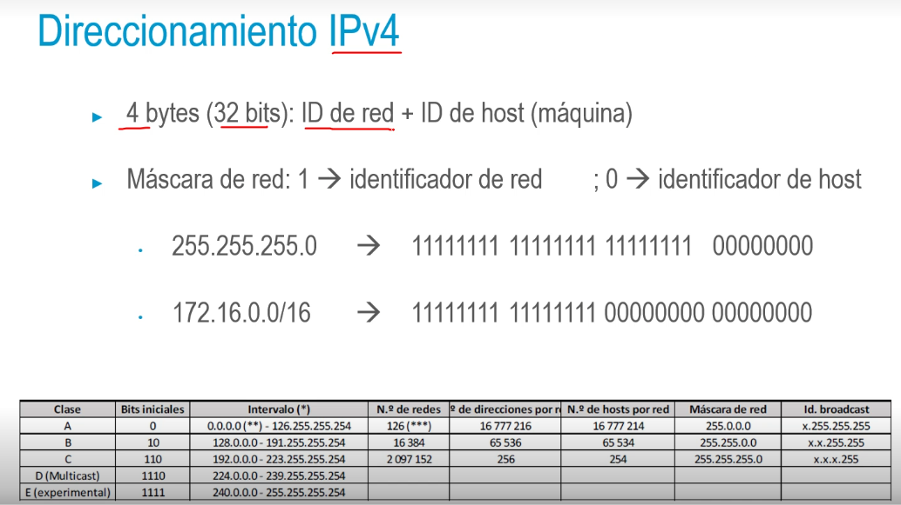
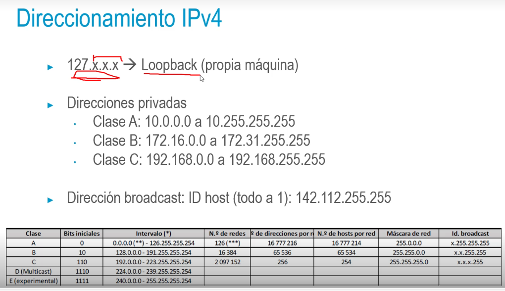
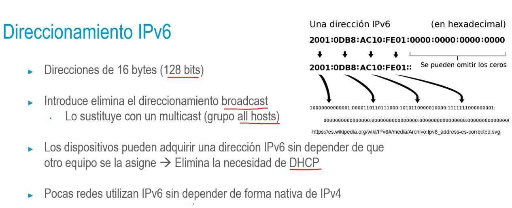

## Protocolos de capa de red: IP
• Internet Protocol (IP)
• Se encarga del encaminamiento de datos por la red
• Servicio no orientado a conexión y utiliza conmutación de paquetes
• Servicio de envío no fiable: sin mecanismos de control de errores ni de
control de flujo (delega estas operaciones en niveles superiores)
• Entrega no ordenada
- 
- 
- 
-
- 
-