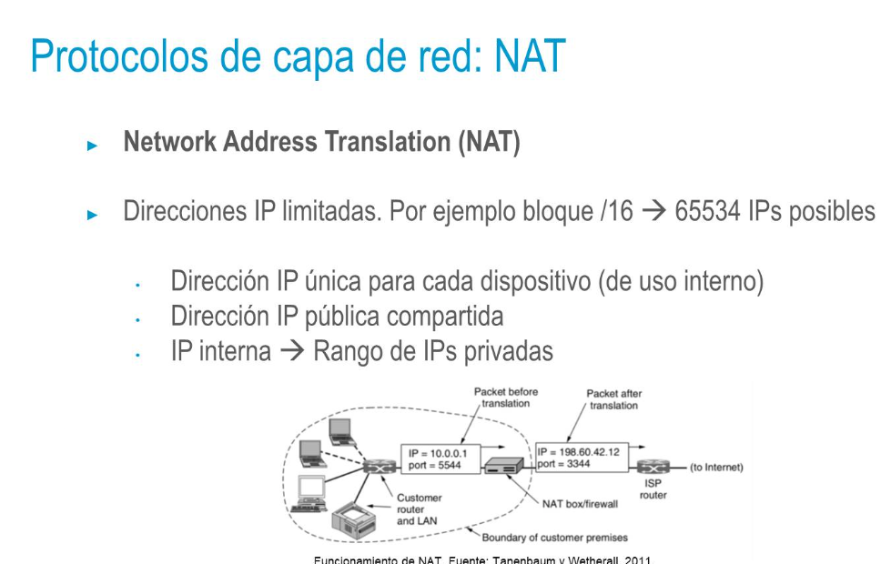
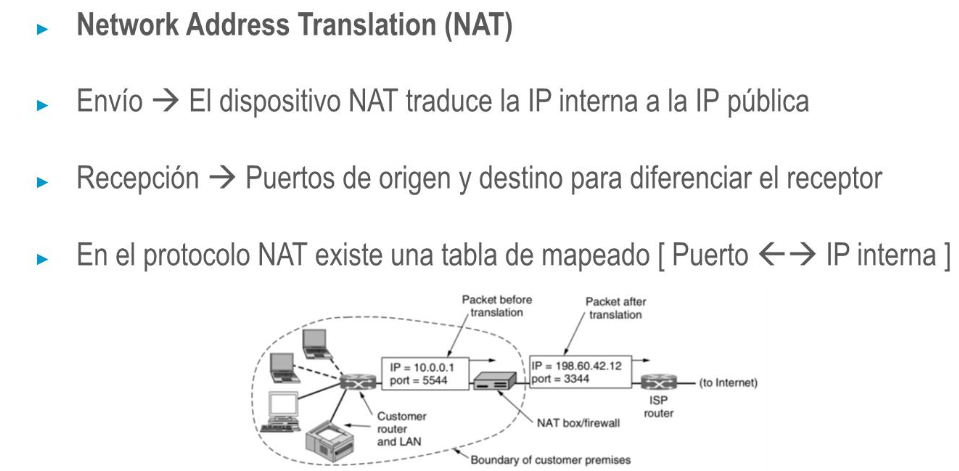

- 
-
- 
- ## Protocolos de capa de red: NAT
  • Criticas a NAT
  • Una IP ya no identifica de forma única a una máquina en el mundo
  • Un paquete entrante no se puede aceptar si no existe un paquete saliente (que haya sido escrito en la tabla NAT)
  • El protocolo IP no es orientado a conexión → Con NAT, "si"
- Se rompe la independencia de capas:
  • Los puertos pertenecen a la capa de transporte NAT utiliza puertos para identificar IPs
  NAT depende del uso de TCP y UDP (capa de red depende de capa de transporte -que es una capa superior-)
-