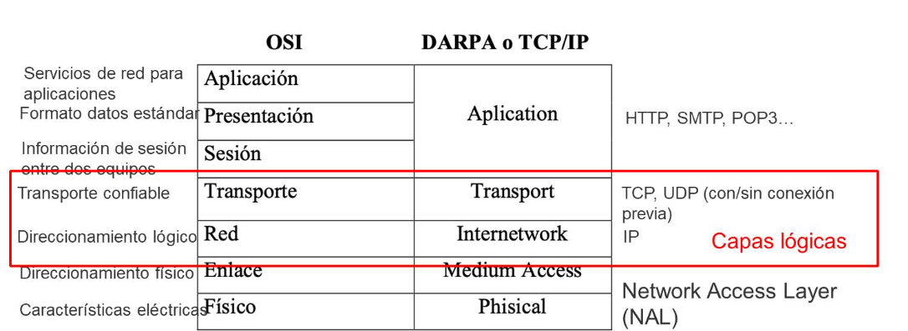
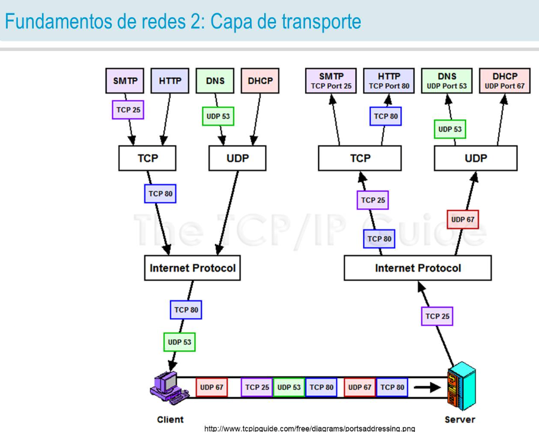
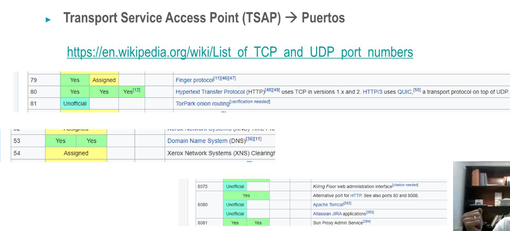

- 
- 
- ## Servicios de la capa de transporte
  • Comunicaciones entre procesos
  • Mecanismos de control de flujo
  • Mecanismos de control de errores
  • Establecimiento de conexiones
  • Tipos de servicio
  • No orientados a conexión I UDP
  • Orientados a conexión D TCP
- ## Puertos
  • Transport Service Access Point (TSAP) → Puertos
  • Identificador del proceso dentro de una máquina
  • Fundamentales para la comunicación entre dos máquinas que pueden tener múltiples procesos 
     diferentes cada una
  • 65536 puertos posibles (IANA, Internet Assigned Number Authority)
  • Well-Known Ports (0 al 1023): asignados oficialmente por la IANA
  • Registered Ports (1024 al 49151): reservados bajo petición IANA
  • Dynamic Ports (49152 al 65535): no registrados por la IANA
- 
-