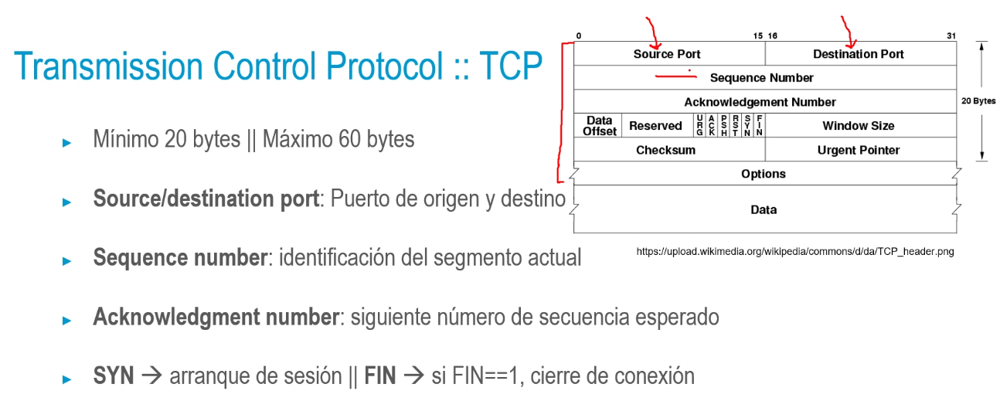
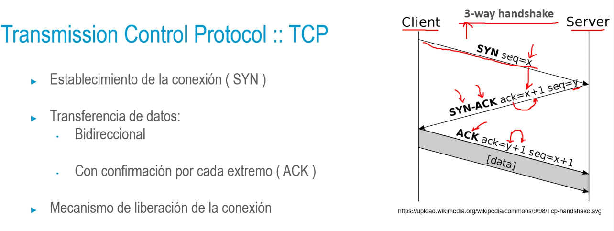
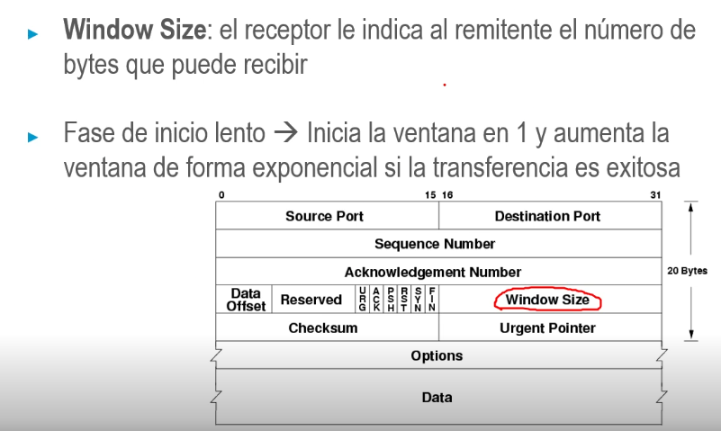
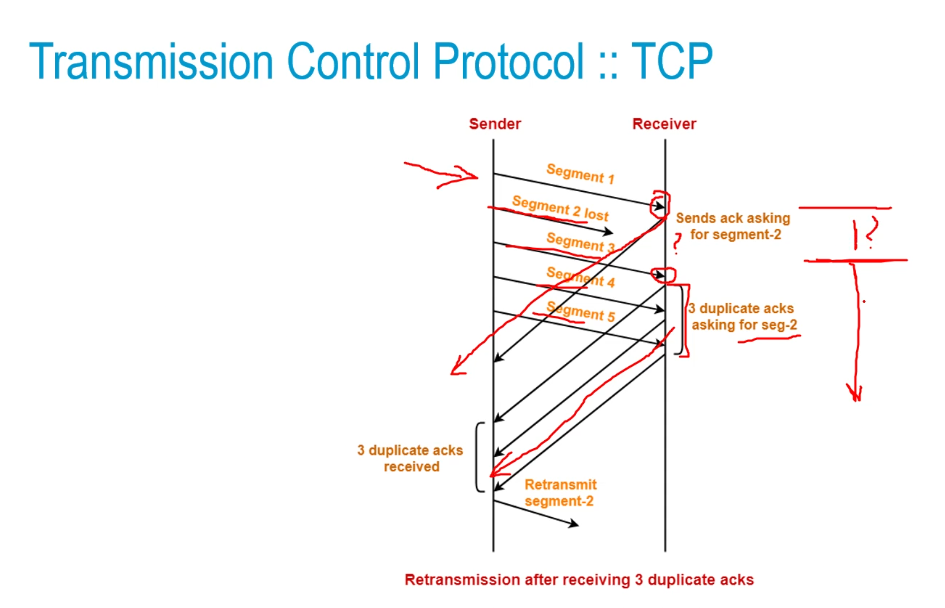
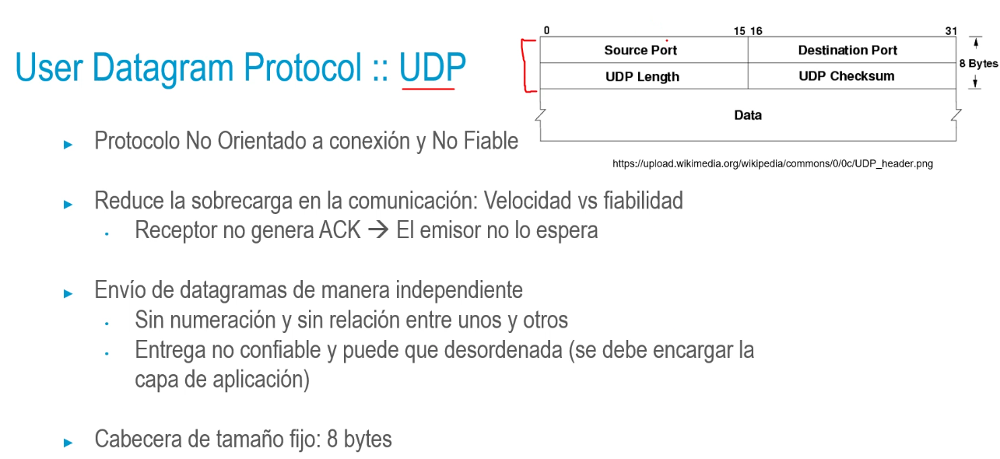

## Transmission Control Protocol :: TCP
• Protocolo Orientado a conexión y Fiable
• Conexión virtual bidireccional entre procesos de dos máquinas
• Posee mecanismos de:
• Control de flujo: evitar que un emisor rápido sature a un receptor
lento
• Control de errores: detectar segmentos corruptos
• Control de congestión de red: volumen de datos depende también
del medio

- 
- 
- 
-
-
- 
- 