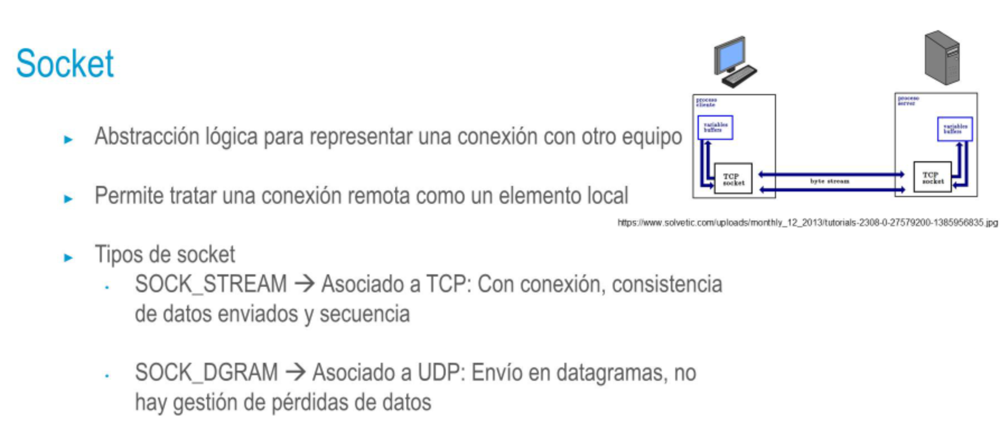

- Servicios de la capa de aplicación
  • NO es la interfaz gráfica de las aplicaciones
  • Ofrece a las aplicaciones los servicios de comunicación
  • Servicios de envío de correo electrónico
  • Servicios de navegación web
  • Servicios de transferencia de archivos
  • etc
  • Hace que las comunicaciones sean transparentes para el desarrollador
  de una aplicación
  • Cada servicio tiene su protocolo propio
- 
- ### Remote Procedure Call (RCP)
  • Mecanismo para la llamada de un procedimiento remoto
  El proceso de cliente invoca el código que simula la funcionalidad
  remota como si fuera una llamada local. La llamada incluye todos
  los parámetros necesarios.
  La función, junto con los parámetros, se empaqueta y se realiza una
  llamada al sistema para enviarlos a través de la red.
  El sistema operativo envía los datos a través de la red.
  El host remoto recibe los datos y los pasa al proceso del servidor,
  que desempaqueta la función y los parámetros.
  Los parámetros se pasan al procedimiento local y el procedimiento
  es entonces ejecutado.
  El resultado se envía al cliente de la misma manera.