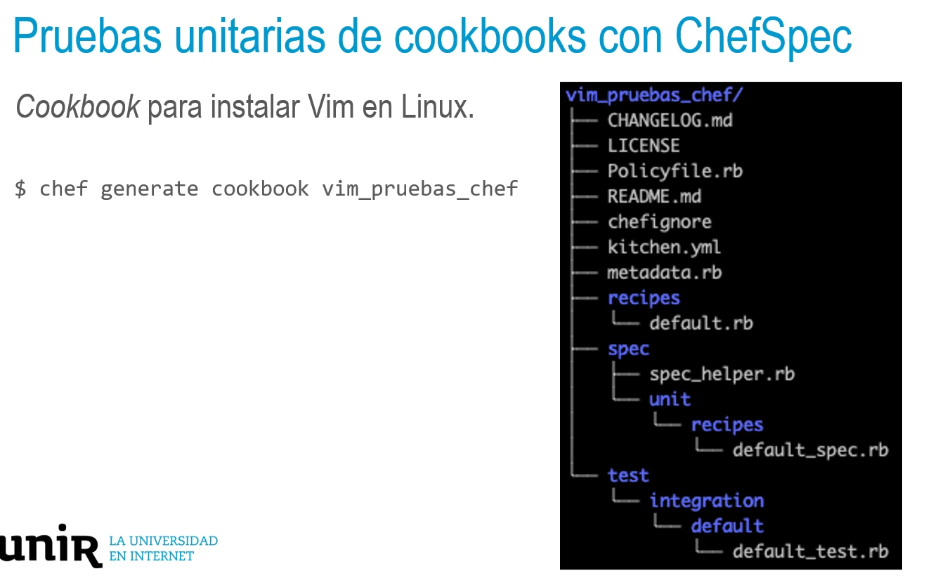

## Buenas prácticas gestión de la infraestructura
• Aplicación de buenas prácticas en la gestión de la infraestructura.
• Sistema de control de versiones para almacenar y gestionar ficheros de definición de la
configuración (cookbooks).
Definir pruebas para verificar que la configuración hace lo que se espera.
• Garantizar que futuros cambios en la configuración no producen efectos no deseados en los
recursos (regresión).
- ## Conjunto de pruebas
  Pruebas unitarias: verificar la funcionalidad de un elemento individualmente.
  Pruebas de integración: verificar cómo interactúan un conjunto de elementos entre sí.
- ## Pruebas unitarias de cookbooks con ChefSpec
  > Aprovechar el hecho de tratar la infraestructura como código para verificar la funcionalidad
  de configuración requerida.
  • Heredado del mundo de las metodologías ágiles.
  • Chef incorpora herramientas para esta gestión de forma similar a como se implementa en el
  código fuente de las aplicaciones.
  • La forma fundamental de pruebas son los test unitarios → ChefSpec, framework de Chef
  construido sobre RSpec, herramientas de pruebas de Ruby.
  Instalación del paquete Chef Workstation o el kit de desarrollo Chef
  https://downloads.chef.io/tools/chefdk
- 
- ## Pruebas unitarias de cookbooks con ChefSpec
  >context 'with default attributes' do
  it "should have default install_method 'package'" do
  expect (chef.
  _run.node['vim']['install
  _method ']). to eq( 'package-fake')
  end
- > it "should include the vim_pruebas_chef: :package recipe when
  install_method= 'package'" do
  expect(chef_run). to include_recipe( 'vim_pruebas_chef: :package')
  end
  end
-