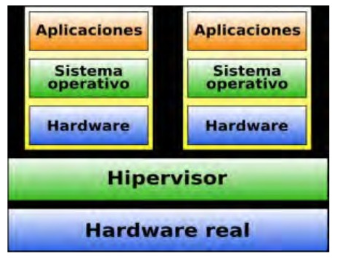
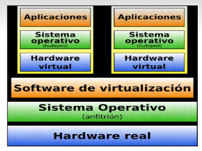

- • La virtualización de un servidor es cuando se particiona un servidor físico en
  pequeños servidores virtuales. En la virtualización de servidor los recursos del
  propio servidor son escondidos o enmascarados a los usuarios. El software es
  usado para dividir el servidor físico en múltiples entornos virtuales, llamados
  servidores virtuales o servidores privados.
  • Razones para virtualizar
  • Virtualizar la infraestructura de Tl permite reducir los costes de TI y
  aumentar la eficacia, el uso y la flexibilidad de los activos existentes.
  • En todo el mundo, organizaciones de todos los tamaños se benefician de la
  virtualización.
  • Miles de organizaciones (incluidas todas las de la lista Fortune 100) utilizan
  soluciones de virtualización.
- • Un hipervisor, también llamado monitor de máquina virtual (virtual machine monitor, VMM), es una
  plataforma de virtualización que permite utilizar, a la vez, múltiples sistemas operativos en un equipo.
  Los hipervisores se pueden clasificar en dos tipos:
  • Tipo 1 (nativo, baremetal o unhosted).
  • Tipo 2 (hosted).
-
- ### Hipervisor de tipo 1 (Nativo o unhosted)
  • Software que se ejecuta directamente sobre el hardware real del equipo para
  controlar el hardware y monitorizar los sistemas operativos virtualizados.
  • Los sistemas virtualizados se ejecutan en otro nivel por encima del hipervisor.
  • Algunos de los hipervisores tipo 1 más conocidos son los siguientes:
  • VMware: ESXi (gratis), ESX (de pago).
  • Xen (libre).
  • Citrix XenServer (gratis).
  • Microsoft Hyper-V Server (gratis).
  • Otros...
- 
-
- ### Hipervisor de tipo 2 (Hosted)
- • Aplicación que se ejecuta sobre un sistema operativo convencional (Linux,
  Windows, MacOS) para virtualizar sistemas.
  • De esta forma, la virtualización se produce en una capa más alejada del
  hardware si lo comparamos con los hipervisores de tipo 1. Lógicamente,
  esto hace que el rendimiento sea menor en los hipervisores de tipo 2.
  Algunos de los hipervisores tipo 2 más utilizados son los siguientes:
  • Sun: VirtualBox (gratis), VirtualBox OSE (libre).
  • VMware: Workstation (de pago), Server (gratis), Player (gratis).
  • Microsoft: Virtual PC (gratis).
  • Parallels: Parallels Virtuozzo Containers (gratis).
  Otros
-
- {:height 257, :width 332}
- Las máquinas virtuales son un componente básico fundamental de una
  solución mucho mayor: la infraestructura virtual.
  • Mientras que una máquina virtual representa los recursos de hardware de todo
  un ordenador, una infraestructura virtual representa los recursos de hardware
  interconectados de la totalidad de una infraestructura de TI, lo que incluye
  ordenadores, dispositivos de red y recursos compartidos de almacenamiento.
  * La idea es desvincular el entorno de software de la estructura de hardware
  subyacente para poder agregar varios servidores, infraestructura de almacenamiento y redes a los pools de recursos compartidos.
  • Después, proporciona estos recursos dinámicamente, de manera segura y
  fiable, a las aplicaciones conforme los vayan necesitando.
  Este enfoque permite utilizar los servidores estándar de bajo coste como
  componentes básicos para la creación de un centro de datos.
-
- ### Beneficios principales
- • En general, las máquinas virtuales cuentan con cuatro características clave que benefician al usuario:
  • 1. Compatibilidad: las máquinas virtuales son compatibles con todos los ordenadores x86 estándar.
  • 2. Aislamiento: las máquinas virtuales están aisladas unas de otras, como si estuvieran separadas
  fisicamente.
  • 3. Encapsulamiento: las máquinas virtuales encapsulan un entorno informático completo.
  • 4. Independencia del hardware: las máquinas virtuales se ejecutan de forma independiente del
  hardware subyacente.