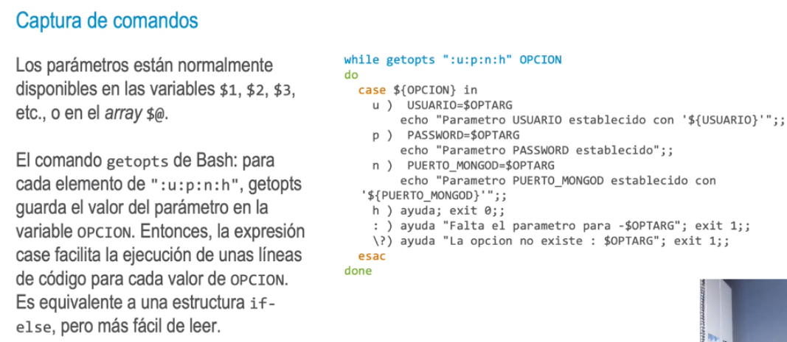
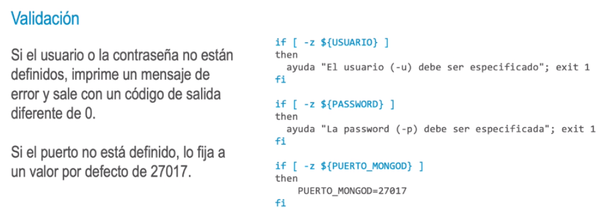
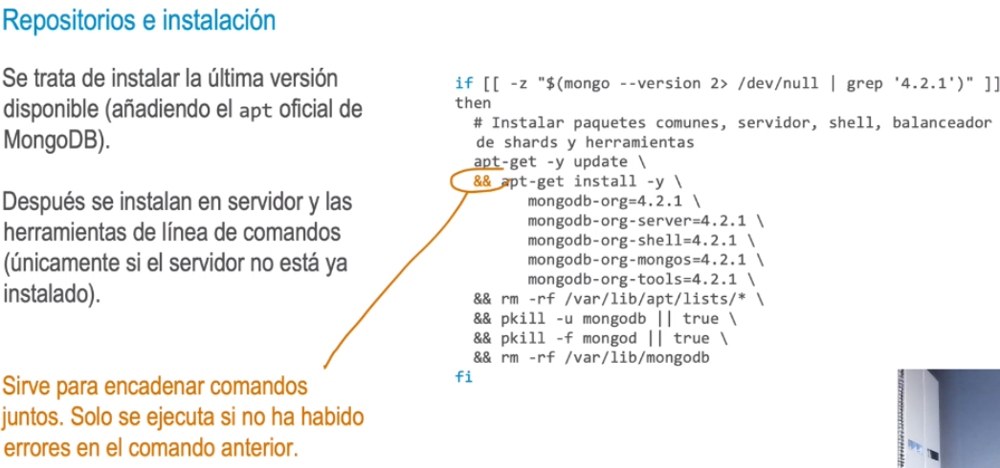
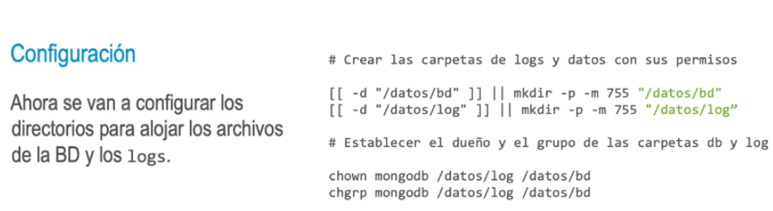
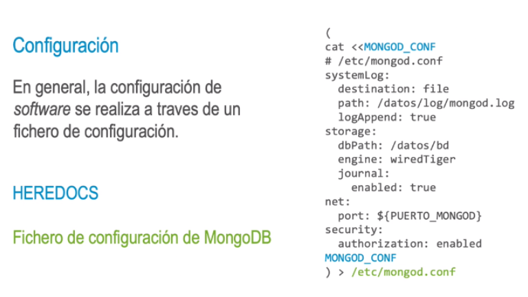
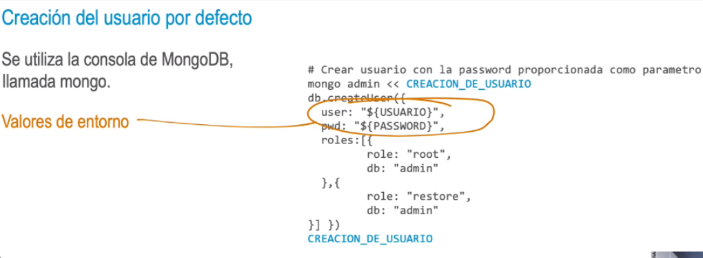

### Instalacion de MongoDB
- • Ejecución.
  • Shebang.
  • Función de ayuda.
  • Captura de parámetros.
  • Validación.
  • Repositorios e instalación.
  • Configuración.
  • Creación del usuario por defecto.
  • Comprobación.
- Ejecución:
  > bash install.sh -u usuario -p password -n puerto
  bash install.sh -u ubuntu -p ubuntu_pass -n 27017
- Shebang:
  #!/bin/bash
  set -e #con este comando se sale del script si cualquiera de los comandos falla. De esta forma nos
  aseguramos que no va a haber instalaciones incompletas.
- {:height 239, :width 530}
-
- 
-
- 
-
- 
-
- 
-
- 
-