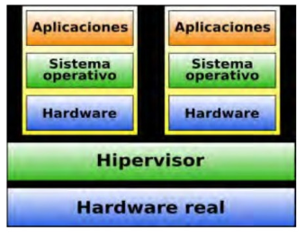

- • Un hipervisor, también llamado monitor de máquina virtual (virtual machine monitor, VMM), es una
  plataforma de virtualización que permite utilizar, a la vez, múltiples sistemas operativos en un equipo.
  Los hipervisores se pueden clasificar en dos tipos:
  • Tipo 1 (nativo, baremetal o unhosted).
  • Tipo 2 (hosted).
-
- ### Hipervisor de tipo 1 (Nativo o unhosted)
  • Software que se ejecuta directamente sobre el hardware real del equipo para
  controlar el hardware y monitorizar los sistemas operativos virtualizados.
  • Los sistemas virtualizados se ejecutan en otro nivel por encima del hipervisor.
  • Algunos de los hipervisores tipo 1 más conocidos son los siguientes:
  • VMware: ESXi (gratis), ESX (de pago).
  • Xen (libre).
  • Citrix XenServer (gratis).
  • Microsoft Hyper-V Server (gratis).
  • Otros...
- 
-
- ### Hipervisor de tipo 2 (Hosted)
- • Aplicación que se ejecuta sobre un sistema operativo convencional (Linux,
  Windows, MacOS) para virtualizar sistemas.
  • De esta forma, la virtualización se produce en una capa más alejada del
  hardware si lo comparamos con los hipervisores de tipo 1. Lógicamente,
  esto hace que el rendimiento sea menor en los hipervisores de tipo 2.
  Algunos de los hipervisores tipo 2 más utilizados son los siguientes:
  • Sun: VirtualBox (gratis), VirtualBox OSE (libre).
  • VMware: Workstation (de pago), Server (gratis), Player (gratis).
  • Microsoft: Virtual PC (gratis).
  • Parallels: Parallels Virtuozzo Containers (gratis).
  Otros
-
- {:height 257, :width 332}
-