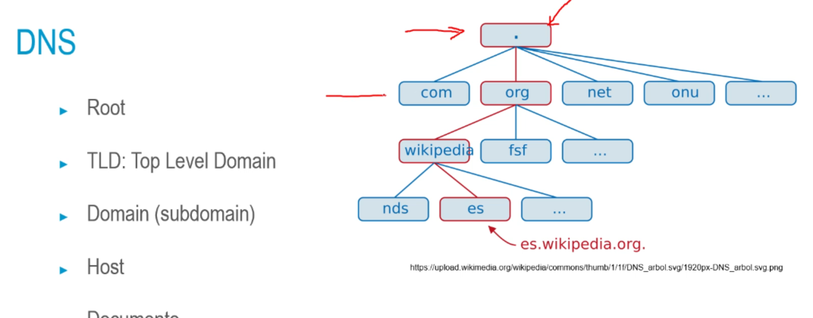
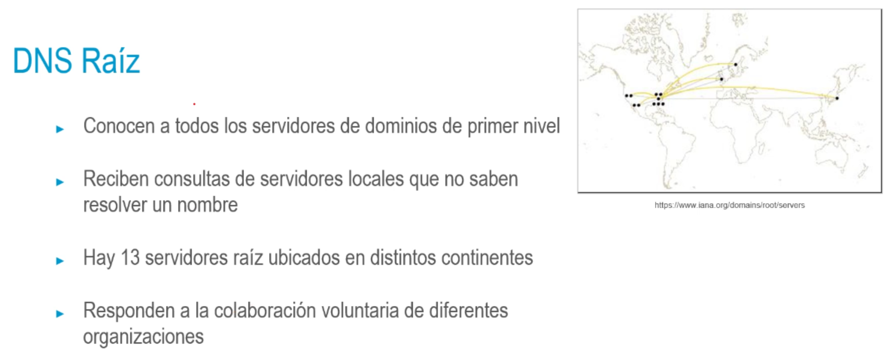
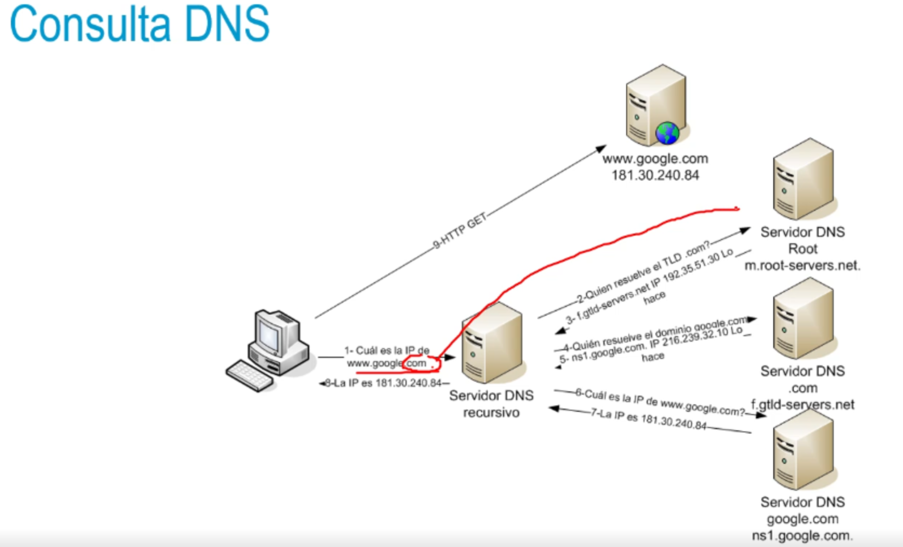

## DNS
• Domain Name System: https://www.rfc-editor.org/rfc/rfc5890 || 5891
• Traducción IP € → Dominio
• Base de datos distribuida (a nivel mund.)
• Jerarquía de servidores
• Protocolo de capa de aplicación para consulta
• Alias de host: varios nombres, misma máquina
• Alias de servidor de correo: traducción
• Distribución de carga: servidores replicados (Varias IPs, mismo nombre)
- 
- 
- ### DNS
  • ICANN (Internet Corporation for Assigned Names and Numbers) coordina:
  • gestión de nombres de primer nivel, así como direcciones IP y otros
  identificadores utilizados en protocolos (ej: puertos)
  • El sistema de servidores DNS raíz
  • Se delega responsabilidad por zonas
  • NIC (Network Information Center), autoridad en cada país para gestión
  de dominios bajo ese país
  • En España, los dominios ".es" los gestiona la entidad pública Red.es a
  través de ESNIC
- Registros DNS :: Registros de recursos (RR)
  <Name TTL Class Type Value>
  → www.unir.net.
  7200- IN A 108.157.98.75
  • Туре:
  • SOA: Start Of Authority → Identificación del dominio
  • A: resolución IPv4 || AAAA: resolución IPv6
  • NS: consulta servidor de nombres propietario del dominio
  • MX: información de servidor de correo electrónico
  • Class
  • Internet, Chaos, Hesiod
  • TTL
  Time To Live: tiempo de validez de este reaistro en caché
- 
-