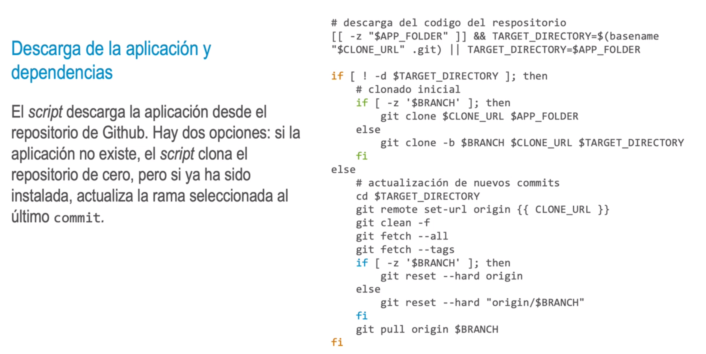
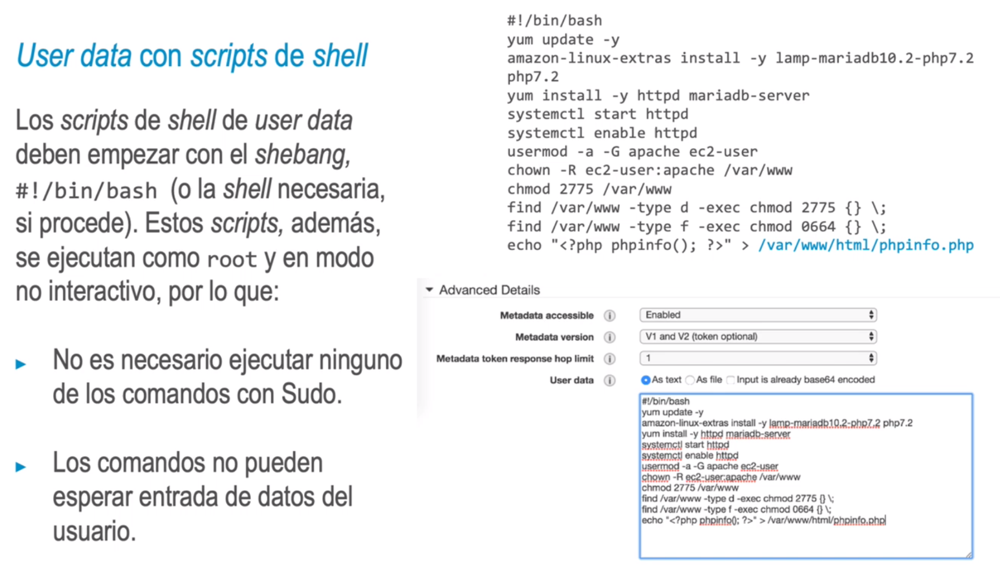
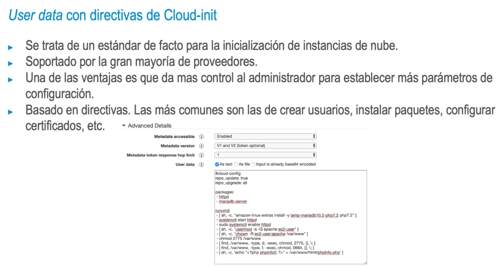
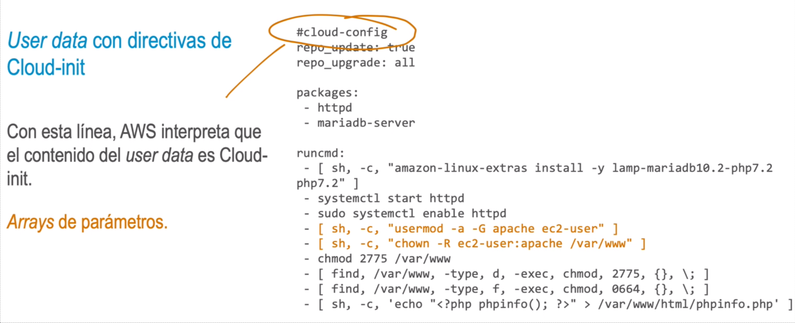

- Instalación multidistribución
  El script está preparado para distribuciones RedHat como Ubuntu (en este caso,
  comprobando la existencia de los ficheros propios de las distribuciones).
  En este caso, en cambio utiliza la existencia del fichero (y que sea ejecutable).
- > if [[ -e /etc/redhat-release || release ]]:
  then
  -e /etc/system-
  if [[ -x /usr/bin/yum ]];
  then
- 
- • Los scripts que hemos visto se podrían ejecutar perfectamente desde una herramienta de
  automatización como Puppet o Ansible.
  • Ahora vamos a hacer uso del user data de las instancias de AWS.
  • Las instancias Linux de EC2 aceptan dos tipos de user data: scripts de shell y directivas de Cloud-init.
  • Vamos a ver ambos metodos instalando un servidor web con pila LAMP (Linux, Apache, MySQL y
  PHP).
- 
- 
-
- 
-