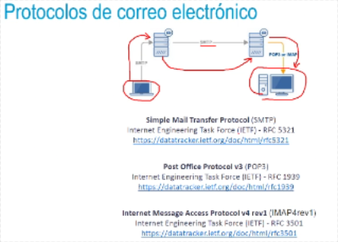
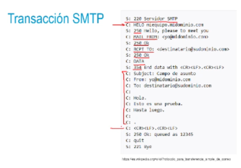

## Protocolos de correo electrónico
• Correo electrónico (email): medio de comunicación asincrono entre un
emisor y múltiples destinatarios con posibilidad de incluir archivos
identificadorLocal @ Dominio
• La emisión y recepción de emails es un
aplicación al desarrollador
icio que ofrece la capa de
• Si el servidor de origen y el servidor de destino es el mismo → No existe
envio a la red
• Protocolos de recepción (POP; IMAP) && Protocolos de envio (SMTP)
Webmail HTTP → Envio SMTP desde el servidor remoto
- 
-
- ## Transacción SMTP
  • Cliente establece conexión SMTP con servidor (comando HELO)
  • Respuesta 220 (Service ready) ó 421 (Service non available) |
  • Cliente envia MAIL FROM → MAIL FROM<origen@cliente.org>
  • Servidor responde 250 (OK)
  • Cliente envia RCPT TO → RCPT TO ‹destino@servidor.org>
  • Servidor responde 250 (OK) 6 550 (No such user here)
  • Envia orden DATA → Para indicarle al servidor que comenzará a
  enviar los datos del email |
  • Respuesta 354 (Start mail input, end with < CRLF>,<CRLF>)
  • Envia el cuerpo del email. Finaliza con ‹CRLF>.<CRLF>|
  • Respuesta 250 (OK) u otro código de error
- • Cliente envia QUIT
- 
- ## Protocolos de correo electrónico
  • Para poder recuperar el correo existente en un servidor de correo, se ha de
  usar otro protocolo de acceso. En este caso hay dos opciones:
  • El protocolo POP3: muy sencillo y de funcionalidad bastante limitada,
  permite descargar correos, marcándolos opcionalmente para su
  borrado en el servidor.
  • El protocolo IMAP: bastante más sofisticado que el anterior, permite
  organizar los correos en carpetas en el servidor. En todos ellos tendrá
  la misma vista de la organización por carpetas y acceso a todos los
  correos.
- • Para poder recuperar el correo existente en un servidor de correo, se ha de
  usar otro protocolo de acceso. En este caso hay dos opciones:
  • El protocolo **POP3:** muy sencillo y de funcionalidad bastante limitada,
  permite descargar correos, marcándolos opcionalmente para su
  borrado en el servidor.
  • El protocolo **IMAP:** bastante más sofisticado que el anterior, permite
  organizar los correos en carpetas en el servidor. En todos ellos tendrá
  la misma vista de la organización por carpelas y acceso a todos los
  correos.
-