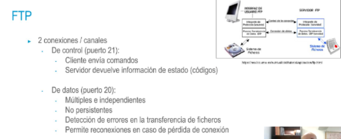

## FTP
• File Transfer Protocol: permite intercambio de ficheros entre dos
máquinas → IETF RFC 959: https://www.rfc-editor.org/rfc/rfc959
• Cargas y descargas de archivos a través de
un servidor
mandos entre un cliente y
• Estructura jerárquica de directorios
- 
-