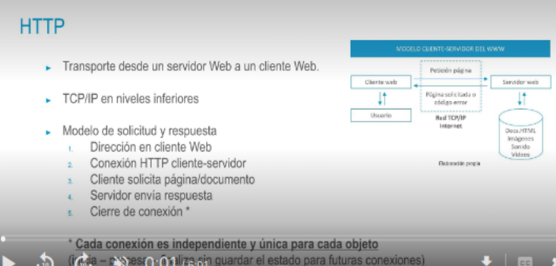
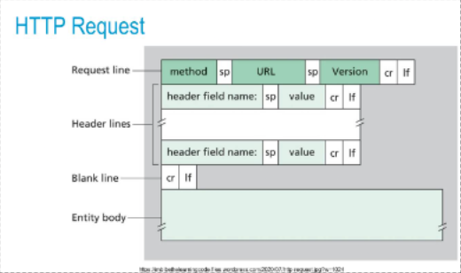
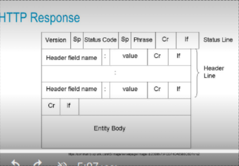

- {:height 267, :width 541}
- 
- ## HTTP Request
  • Método|
  POST. Envia datos para que un recurso los procese
  • HEAD: Similar a GET, pero obtiene únicamente la cabecera
  • PUT: Actualiza un recurso enviado en el cuerpo del mensaje
  • DELETE: Elimina un recurso
  • URL → URI (Universal Resource Identifier)|
  • Cabeceras: indican las capacidades aceptadas por el emisor:
  • Accept: Tipo de datos aceptado (image/jpeg, text/html, etc)
  • Accept-charset: código de caracteres aceptado (UTF-8, US-ASCIl, etc)
  Allow: métodos permitidos (e.g. Allow: GET, POST, HEAD )
  GET /index-html HTTP/1.2
  Host: mor.unir.net
- 
- ## HTTP Response
  HТТР/1.1. 200 ск
  Gates Pan, 34 Now 3014 22118184 00
  • SN
  Centent-Typer text/Maly carset-ulf-a|
  Accept-Rangest bytes
  «title jerple HITPtitle>
  «/head»
  Esto es une pigine de preebes.