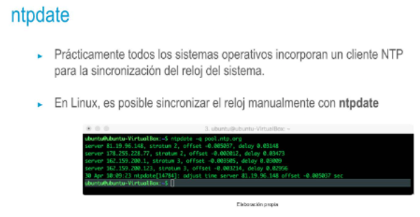

## NTP
• Network Time Protocol|
• https://datatrackerietf.org/doc/html/rfc958/
• Protocolo de sincronización de reloj]
• Un equipo realiza petición a servidor para actualizar su reloj local sin |
necesidad de intervención del usuario
• Utiliza UDP en capa de transporte, sobre el puerto 123
• No puede depender de TCP, ya que éste introduciría un retardo
- 
-