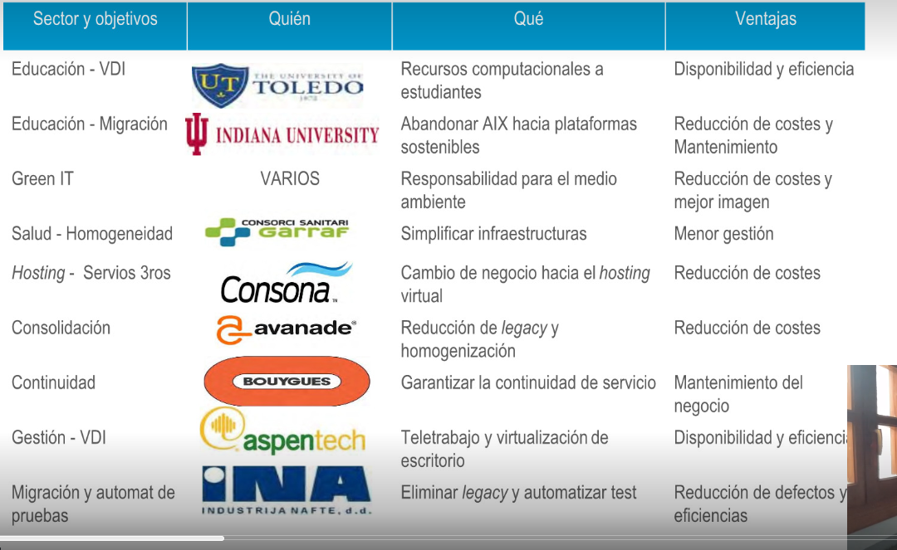

- • La revisión de casos de uso ayuda a entender las ventajas y a aprender de las experiencias previas
  de otros expertos. Algunas de las áreas más habituales son:
  • Educación Green IT Salud.
  • Proveedores de Hosting Pymes.
  • Consolidación continuidad.
  • Desarrollo escritorio.
  • Oficina remota tecnología aplicaciones.
  • Migración.
- 
-
-