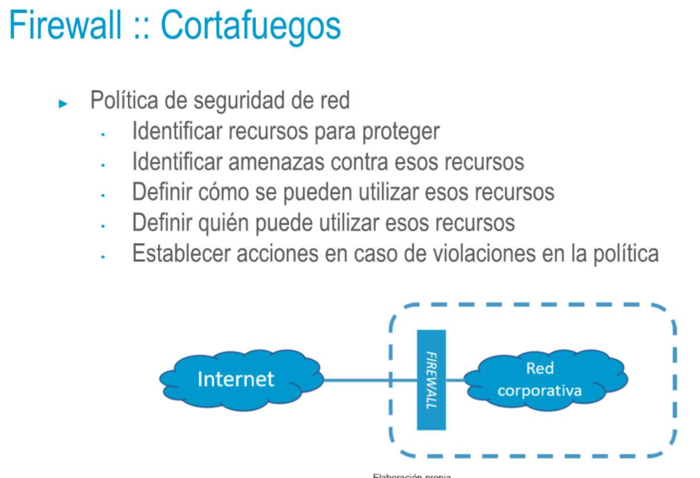
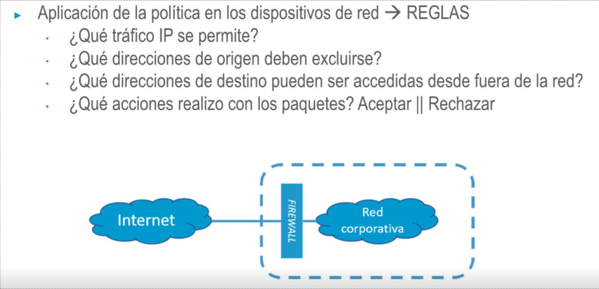

## Firewall :: Cortafuegos
• Sistema de seguridad que controla el acceso a una red protegida (como una red corporativa) desde otra red
• La red desde la que se hace la petición puede ser una red pública (e.g. Internet) u otra red interna
• Se sitúa en el punto de interconexión entre ambas redes
• Puede proporcionar servicios de autenticación (y otros) a usuarios remotos

- 
- 
-
-