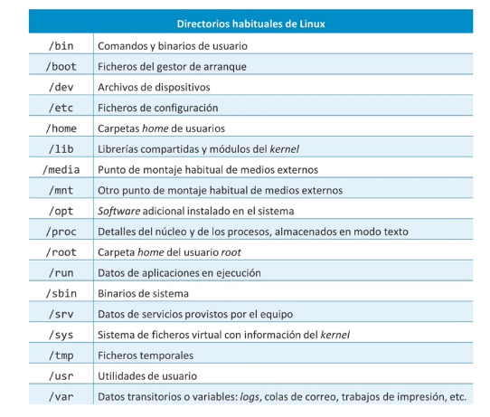
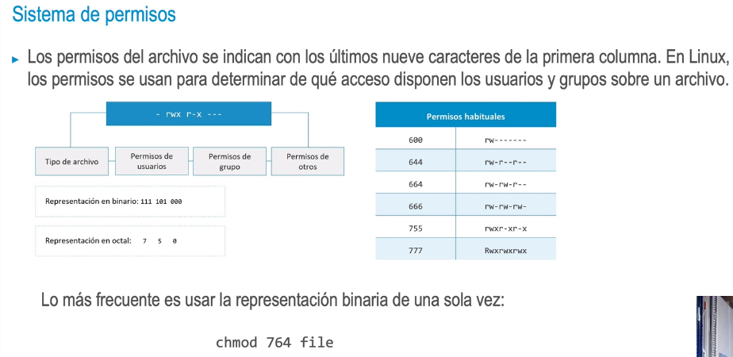

- Archivos
  • Cualquier elemento en Linux es un archivo, incluso los directorios son archivos que contienen los
  nombres de otros archivos.
  • El comando pwd da información sobre el directorio actual y cd permite cambiar de directorio.
- > ~$ pwd
  /home/ubuntu
  ~$ cd /var/log
  /var/log$
- Arbol de directorios
  • Al contrario que Windows, todo el sistema operativo de Linux
  depende de un único árbol. No hay unidades de disco C: o D:,
  como en Windows. En Linux, todas las particiones, unidades y
  almacenamiento se alojan en algún punto bajo la raíz /.
  • El almacenamiento y las unidades externas se «montan» en
  un directorio. Este directorio aparece como una carpeta más
  del árbol. Por ejemplo, la ruta /media suele alojan las
  unidades del CD (disco duro) y las unidades de USB externas,
  una vez montadas.
  • Se pueden usar rutas absolutas (cd /var/10g) o las rutas
  relativas (cd.., cd., etc.).
- > ~ $ cd /var/1og
  /var/log $ cd 10g
  -bash: cd: 10g: No such file
  or directory
  /var/log $ cd ..
  /var $ cd log
  /var/108/ups /cups
- 
- 
- • Es algo parecido a un enlace directo en Windows. Se usan frecuentemente para poder acceder a un
  archivo directamente sin tener que ir a la ruta.
  • Los enlaces fuertes son referencias reales al archivo. Si se borran, el archivo también desaparece.
  Los enlaces simbólicos son algo parecido a un enlace directo en Windows. Se usan frecuentemente
  para poder acceder a un archivo directamente sin tener que ir a la ruta.
  • Los enlaces se crean con el comando 1n. Los enlaces serán fuertes por defecto y simbólicos con el
  flag -s.