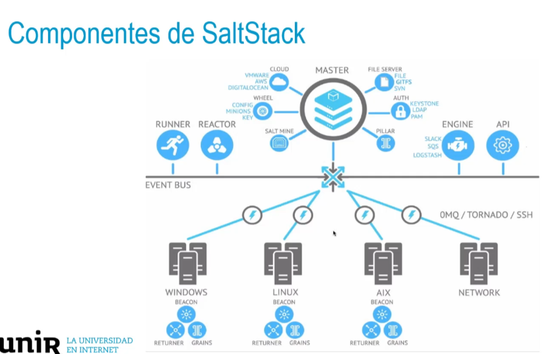

## Rudder
• Ayudar a automatizar la configuración y auditoría de forma continua
en grandes infraestructuras de IT.
• Creado por el equipo fundador de Normation en 2011.
• Es una herramienta gratuita y open source.
• Con una interfaz web bastante fácil.
- • La infraestructura de Rudder utiliza tres tipos de máquinas:
  • Nodos: computadora cliente administrada por Rudder.
  • Servidor raíz: núcleo de la infraestructura.
  • Servidor de retransmisión: actúan como proxy en la red.
- #### Ventajas y desventajas de Rudder
     Ventajas:
  • Los cambios pueden simularse individualmente y mantenerse a lo largo del tiempo.
  • Su interfaz Web permite realizar Ul + CLI + API de forma fácil.
  • Su cliente gestiona hasta 10 000 nodos.
  • Es gratuito y de código abierto. Disponible en Github. 
     Desventajas:
  • Tiene una comunidad de usuarios todavía pequeña.
- ## SaltStack: origen
  • Creado en 2011 como respuesta a la ejecución rápida de
  tareas en los sistemas de data center.
  • Basado en Python .
  • Es una herramienta gratuita y open source.
  • Se apoya en el concepto de «Infrastructure as Code».
- 
-
- ### Ventajas y desventajas de SaltStack
  Ventajas:
  • Gran comunidad de usuarios.
  • De fácil configuración a través de archivos YAML.
  • Puede trabajar sin necesidad de agentes como ocurre con Ansible.
  • Es una herramienta escalable fácilmente a través de capas.
  Desventajas:
  • Fallos de seguridad y escasa actualización.
  • Todavía está poco maduro, con algunos bugs y funciones
  reducidas.