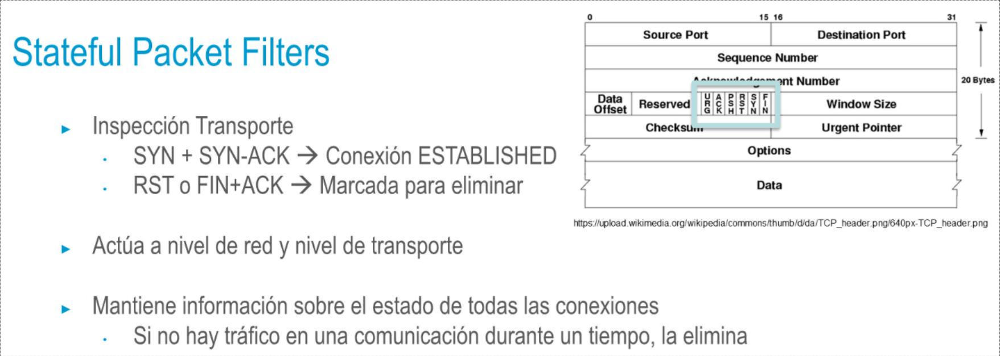

### Packet Filters
-> Inspecciona cada paquete en base a unas reglas de filtrado definidas por el usuario
- -> Las reglas de filtrado pueden estar basadas en:
  • Dirección IP de origen/destino
  • Protocolo de capa de transporte (TCP / UDP)
  • Puerto de destino
- -> Son reglas que actúan a nivel de:
  • Capa de red
  • Capa de transporte
  • Pueden implementarse fácilmente en routers existentes
  -> Son los menos seguros
  • No mantienen registros de intrusiones → no se puede conocer cuándo se
  ha producido una intrusión
  • Una falsificación de puertos podría romper la seguridad de estos firewalls
  -> ICMP Tunneling
  • Ejemplo → No permitir las conexiones Telnet remotas
-
- Plantear regla que bloquee los paquetes con el puerto TCP23 como destino
- 
- ### Application level gateway
  • Proporciona control de acceso a la capa de aplicación
  • Es capaz de examinar el tráfico en la capa más alta → Más seguro →
  Requisitos de procesamiento mayor (afecta al rendimiento de red)
  • Genera registros de todas las actividades y aplicaciones de red
- • Como puede examinar todo el tráfico, puede realizar tareas de ocultamiento de información
  Puede sustituir la dirección de cada paquete por su propia dirección IP →
  Creará una tabla de mapeo → Oculta la dirección IP de cada dispositivo en el tráfico saliente
  • Podría hacer cosas como:
  >Bloquear las peticiones PUT de FTP,
  pero permitir las peticiones GET de FTP
- ### Circuit level gateway
  • Valida las sesiones TCP y UDP antes de permitir una conexión → Trabaja
  en el nivel de sesión del Modelo OSI
  • Participan en el establecimiento de la conexión
  • Mantiene una tabla de conexiones/sesiones válidas
  • No permite el envío de paquetes hasta que hayan pasado con éxito
  las normas de control de acceso
  • Lo que ambas partes perciben es que el tráfico siempre procede del
  Gateway → Redirige solicitudes
  • Una vez que se ha establecido una conexión, cualquier aplicación podría
  ejecutarse a través de esa conexión