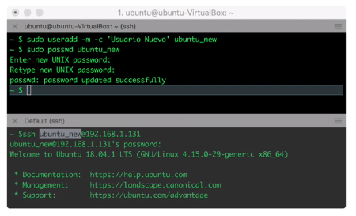

- • Linux es un SO multiusuario (permite el inicio de sesión de múltiples usuarios simultáneamente) y
  también tiene el concepto de grupo (los usuarios pueden pertenecer a uno o mas grupos y suelen
  agregarse a grupos para dar permisos de acceso a ciertos recursos).
  • Por regla general, al crear un usuario, se crea una capeta home, típicamente debajo de la ruta /home.
  Esta carpeta ofrece un lugar en el que los usuarios pueden guardar sus ficheros, además de ser la
  ubicación por defecto que muchas aplicaciones usan para guardar las configuraciones específicas de
  cada usuario.
- • El comando sudo permite la ejecución de comandos administrativos a usuarios distintos de root.
  Las ventajas de Sudo son:
  • Incrementa la seguridad.
  • Permite más granularidad en el control de comandos administrativos.
  • Incorpora auditoría de ejecución.
  • Algunas distribuciones deshabilitan el usuario root, así que Sudo es la única opción.
  • Para modificar permisos de Sudo, hay que editar el fichero / etc/sudoers con el comando especial
  visudo. Este comando también necesita privilegios, así que habría que ejecutarlo con sudo visudo.
- ##### Administración de usuarios
  • El comando useradd permite crear usuarios nuevos. Durante la creación, se especifican el nombre, la
  descripción (con el flag -c), la shell por defecto del usuario (con -s) y si se desea crear la home del
  usuario (con -m). El usuario estará desactivado y sin contraseña, que habrá que añadir con el comando passwd.
- 
- Administración de grupos
  Cada usuario debe de pertenecer al menos a un grupo. Cuando se crea un usuario, se crea un grupo de forma que inicialmente solo ese usuario permanecerá a ese grupo (llamado grupo primario del usuario).
  • $ id ubuntu # el comando id muestra el ID del usuario y los grupos que pertenece.
  • $ sudo useradd -m -G sudo, cdrom ubuntu_sudo # define los grupos suplementarios durante la
  creación del usuario (los grupos sudo y cdrom deben de existir)
  • $ sudo usermod -a -G plugdev ubuntu_sudo # modifica membresía de grupos una vez creado el
  usuario.
  
   > $ sudo groupadd new_group # crea un grupo.
   >  $ sudo groupdel new_group # elimina un grupo.
-