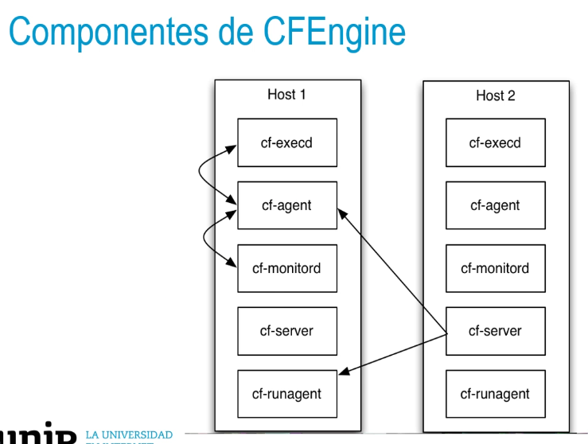

## CFEngine: Origen
• Se crea en 1993 como trabajo de un alumno posdoctoral en la
Universidad de Oslo.
• Plantea un nuevo paradigma: la «inmunología informática»
convergentes.
• Es una herramienta gratuita y open source.
- ## Componentes de CFEngine
  • Los componentes actúan de forma independiente.
  • Se comunican entre ellos siguiendo un protocolo que permite a cada host el distribuir tareas
  y ejecutarlas reportando a un servidor central.
- 
-
- ## Ventajas y desventajas de CFEngine
  Ventajas:
  • Su gran rapidez y grado de escalabilidad basados en la descentralización de la
  infraestructura.
  • Herramienta muy segura y alta trazabilidad.
  • Ocupa pocos MB de memoria.
   Desventajas:
  • Tiene pocos módulos desarrollados.
  • Hay poca documentación.
- Instalación de CFEngine en Ubuntu
  Instalación de los dos repositorios principales:
  Para el policy server:
  >$ dpkg -i <server hub package>. deb
- Para el host:
  >$ dpkg -i < agent package>. deb
- https://docs.cfengine.com/docs/3.15/guide-installation-and-configuration-general-installation.html
- Bootstrap:
  Encontrar la IP del policy server:
  >$ ifconfig
- Ejecutar el comando:
  >$ sudo /var/cfengine/bin/cf-agent --bootstrap <IP address of policy server›