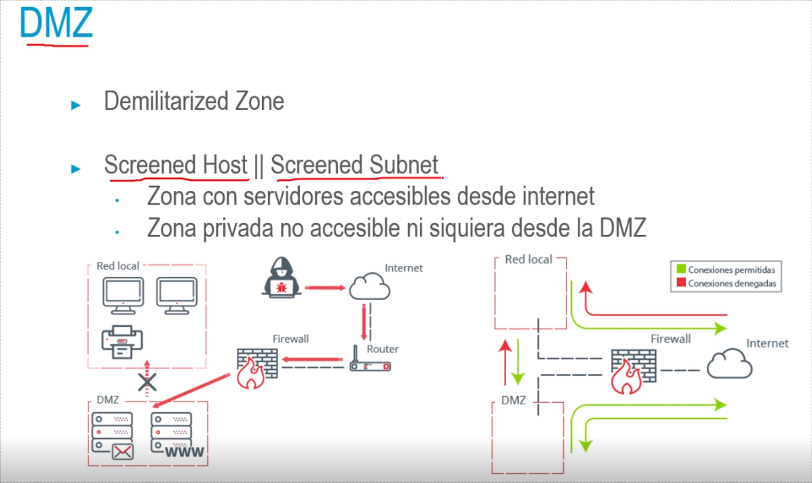

## Arquitectura del firewall
• Forma en la que están dispuestos los componentes del firewall
• Una red corporativa normalmente tiene redes perimetrales
• Red perimetral externa → Límite con los recursos externos (sin proteger)
Redes perimetrales internas → recursos que necesitan seguridad
adicional
- 
- 
- 
- 
-