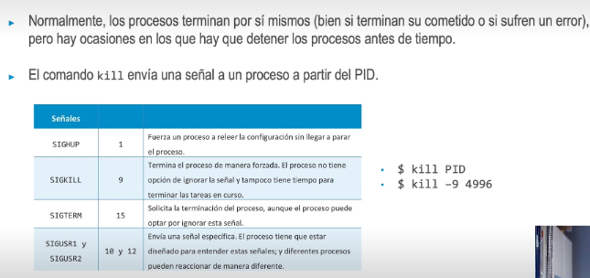
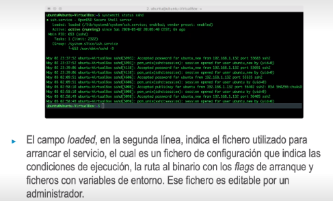

- • Los servicios (también llamados daemons) son procesos que no terminan inmediatamente tras la ejecución, como el comando pwd, sino que se ejecutan continuamente, ofreciendo ciertas funcionalidades al sistema
  operativo o a los usuarios. Ejemplos: daemon de SSH (sshd), Servidor web de Apache (httpd).
  $ ps aux # muestra todos los procesos en ejecución.
  • Los procesos se identifican y controlan por su PID
  ess ID).
  • El proceso con PID 1, /sbin/init, es el primer proceso que arranca y el que se encarga de arrancar otros
  procesos, en otras distribuciones es /sbin/systemd.
  $ top # es una herramienta de monitorización interactiva que muestra los
  procesos en funcionamiento, se actualiza cada pocos segundos y además
  los muestra ordenados por el uso de CPU
- 
-
- • El comando killall permite especificar el nombre del proceso y terminará todos los procesos con
  ese nombre. También se puede especificar el usuario y terminará todos los procesos de ese usuario.
  > $ killall -u username
- pkill se utiliza para terminar los procesos hijos de un proceso padre.
  > $ pkill -P PID
- • La utilidad systemctl permite arrancar, parar, recargar y obtener información de los servicios
  arrancados con Systemd.
  $ systemctl status proceso.
-
- 
-