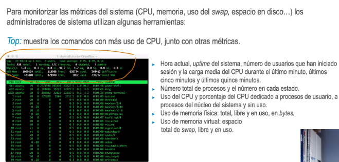
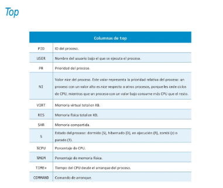
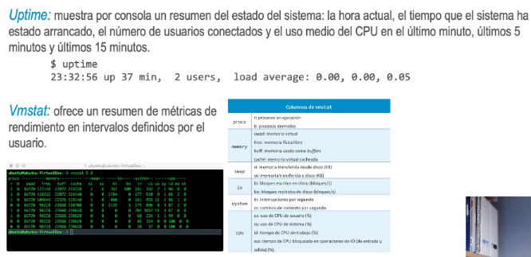
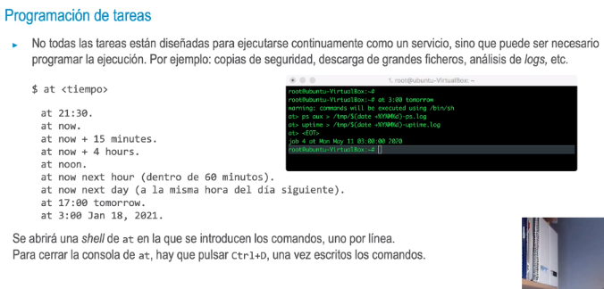
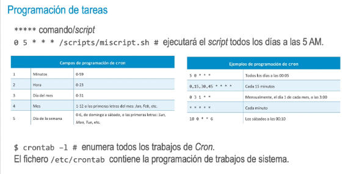

- 
-
- 
-
- 
-
- Df: muestra el espacio disponible en los sistemas de ficheros montados. El modificador -h imprime los
  valores en unidades más legibles para un usuario, como KB, MB, etc.
  > $ df -h
- 
- Programación de tareas
  • Sin embargo, at no permite programar tareas para que se ejecuten periódicamente de forma automática.
  Para esto, utilizamos el servicio cron y el comando crontab.
  • Una limitación es que Cron no permite trabajos con más de un comando, por lo que habrá que recurrir a un script.
  Los pasos para programar un trabajo de cron son:
  • Preparar el script o el comando que se ejecutará.
  • Editar el fichero crontab y ajustar la programación (siguiente slide).
- 
-
-