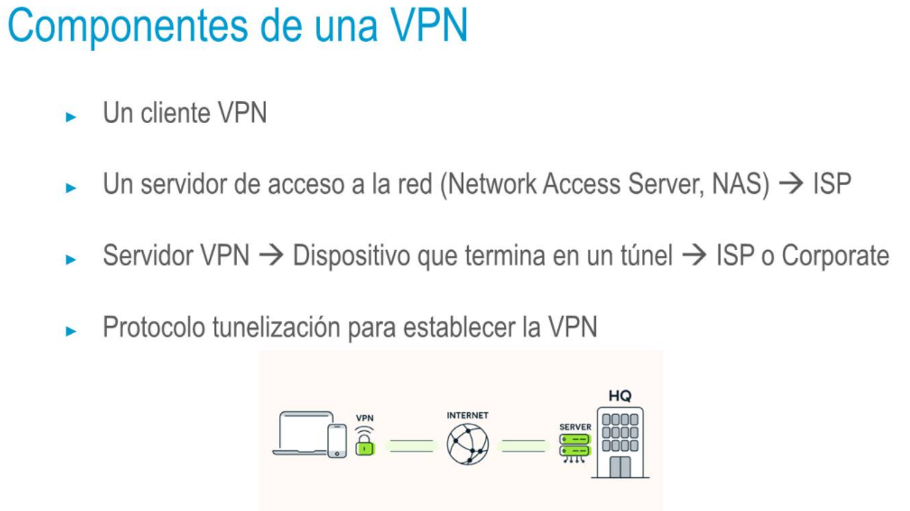
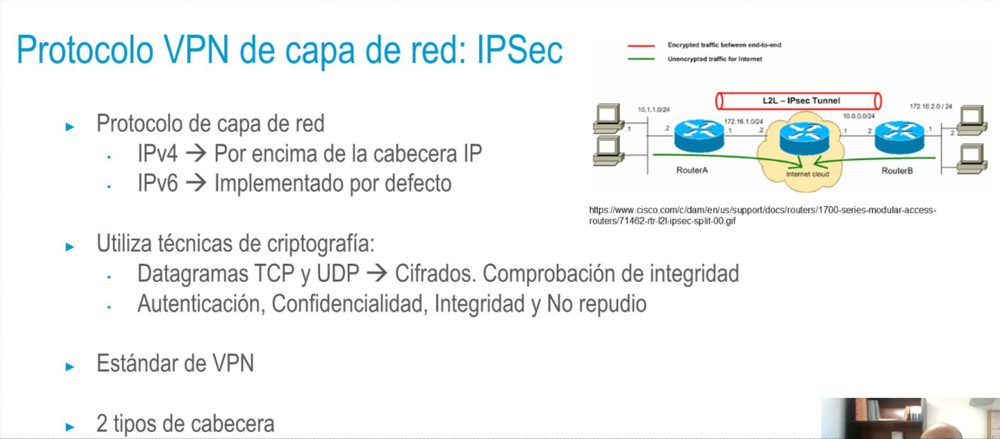
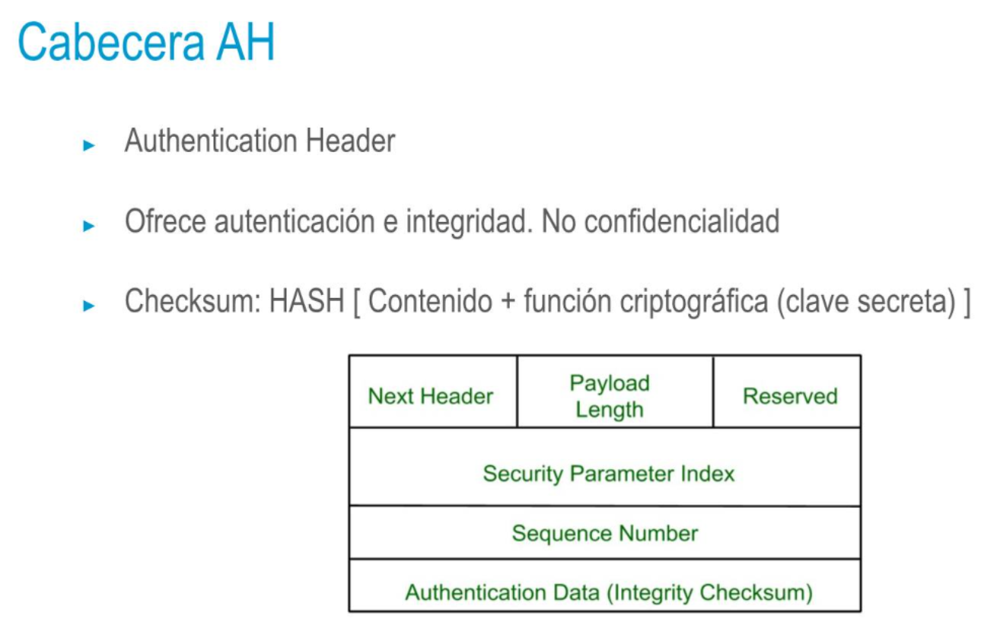
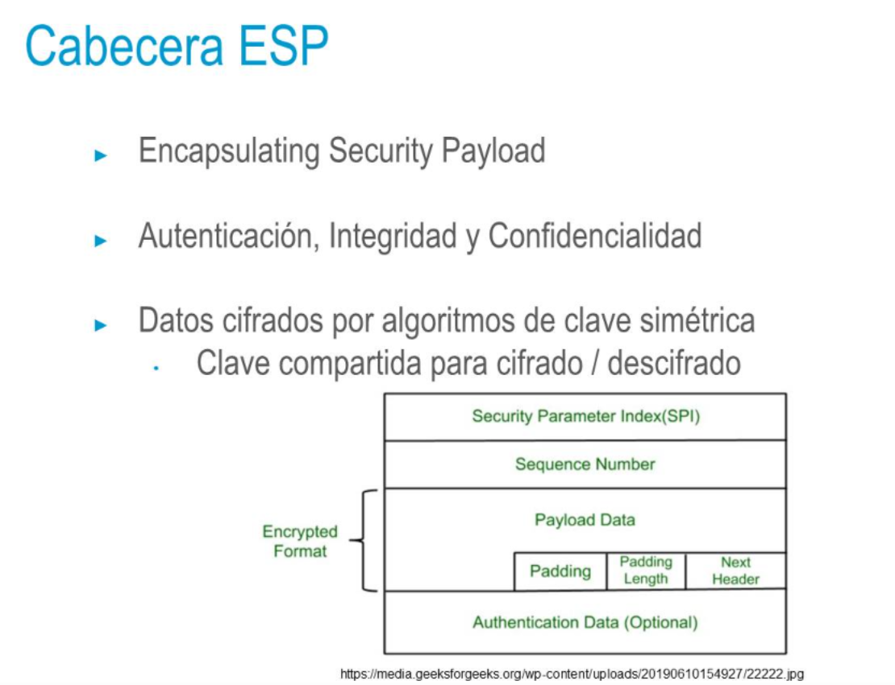
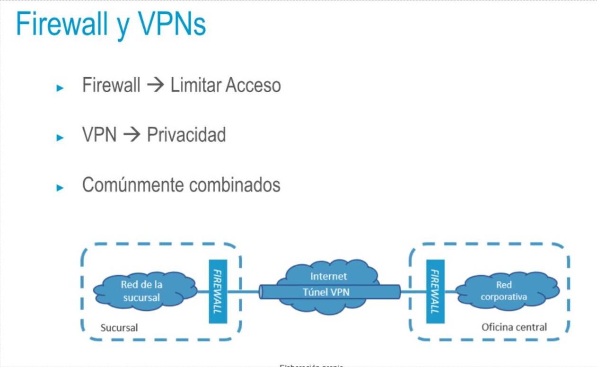

## VPN, Virtual Private Network
• Proporciona una conexión segura entre origen y destino a través de una
red pública no segura
• Cifrado de datos
• No acceso (a los datos descifrados)
• No modificación (sin que se pueda detectar en destino)
• Encapsular IP dentro de IP
• Tráfico IP interno CIFRADO → Red privada
• Tráfico IP externo → Flujo a través de la red no segura
• Ventaja → Uso de infraestructura de internet para enlazar diferentes
redes corporativas
- 
- 
- 
- 
- 
-