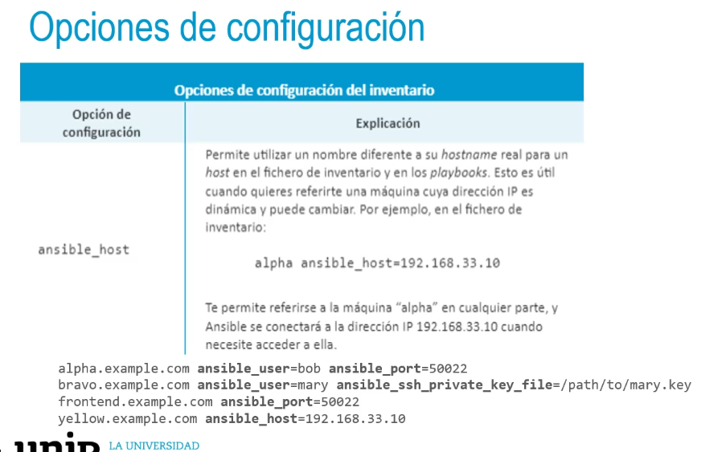
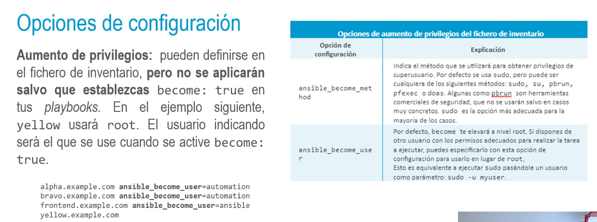

## Fichero de inventario
• Ansible lee el inventario por defecto de /etc/ansible/hosts.
• Lo recomendable es pasarle un fichero por proyecto al comando ansible (ejecutar una tarea) o
ansible-playbook (ejecutar un playbook) mediante la opción - i. Ejemplo con módulo ping:
>ansible all -i /path/to/inventory -m ping
- • Los ficheros pueden implementarse en INI o JSON. Especificar el puerto si no es el estándar y
  también se pueden especificar rangos.
  >host1.example.com: 50822
  host2.example.com
  host3.example.com
  192.168.9.29
  host [10:30] .example.com
- • vagrant provision: Vagrant utiliza ansible-playbook con la instancia indicada.
  → es Vagrant quien ejecuta Ansible y tiene configurado su inventario.
- • Si queremos nosotros hacerlo manualmente, tendremos que tener la IP (privada por ejemplo)
  de la maquina virtual generada por Vagrant y crear el fichero de inventario con su IP:
  >192.168.33.10 ansible_user=vagrant
  ansible_ssh_private_key_file=.vagrant/machines/default/virtualbox
  /private_key
- • Por último, lanzar el comando:
  >ansible-playbook -i inventory provisioning/playbook.yml
- 
-
- 
- ## Registro de variables de inventario
  • Se pueden definir variables en el fichero de inventario, pero no es lo más adecuado
  generalmente. Hay otros muchos otros lugares donde definir variables en un playbook.
  • Se puede tener más de un fichero de inventario y ejecutar el necesario (útil en entornos de
  dev/pro).
  Ejemplo de variable: vhost, database_name
  >host1.example.com vhost=staging.example.com
  alpha.example.com database_name=prod