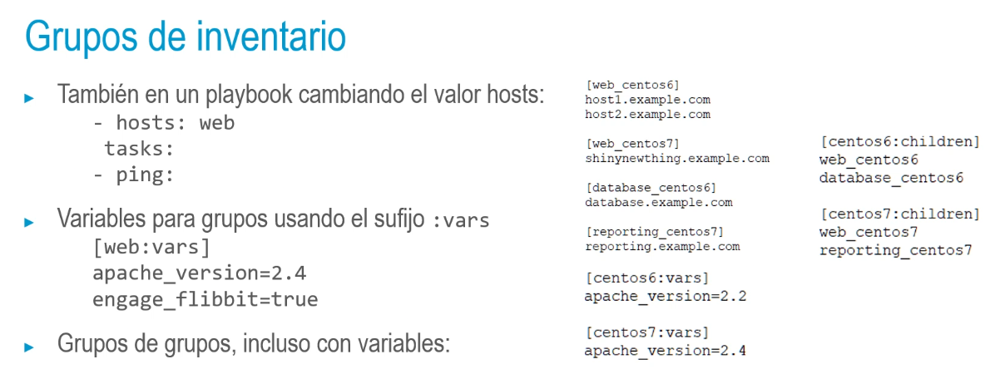

## Grupos de inventario
• Útil para agrupar conjuntos de servidores por tipo: balanceadores de carga, servidores web,
servidores de aplicaciones, bases de datos, etc.:
> [web ]
host1.example.com
host2.example.com
[database]
db.example.com
- • En el formato INI, los corchetes sirven para marcar el nombre de la sección:
  >ansible web -i /path/to/inventory -m ping
- 
- 
- 
- ## Inventarios múltiples
  • Útil para una combinación de máquinas físicas y servidores en la nube.
  • Si se pasa como parámetro un directorio, Ansible leerá todos los archivos y los fusionará.
  • Esto permite tener un fichero de inventario de gestión manual, así como otra parte en
  ec2. py, por ejemplo, que genera dinámicamente el inventario de Amazon EC2.
  • Incluso podríamos tener múltiples archivos INI desglosados por centro de datos o por rol.
-