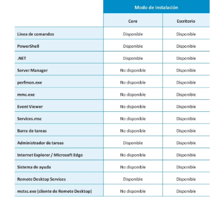

- • El ecosistema de Windows no es tan extenso como el
  de las distribuciones de Linux. Nos vamos a centrar en
  Windows Server.
  • El ciclo de soporte es el periodo para el que Microsoft
  facilita parches de funcionalidad, seguridad y asistencia
  técnica a los clientes. Para Windows Server 2019 es del
  15/10/2019 al 12/1/2027.
  • Windows Server está disponible en dos ediciones:
  Standard y Datacenter, con diferencias en las
  funcionalidades y en el coste.
- * La edición Datacenter se centra fundamentalmente en entornos de virtualización y puede alojar
  infinitas máquinas virtuales (el límite lo pone el hardware, no el software), además de soportar
  SDN (software defined networking, redes definidas por SW).
  • La edición Standard únicamente puede ejecutar dos máquinas.
  • La elección de la versión se realiza durante el proceso de instalación, dependiendo de nuestras
  necesidades.
- Modos de ejecución (ambas versiones)
  • Modo escritorio (Server with Desktop Experience): es lo más parecido a un Windows de escritor
  con botón de inicio, ventanas y consolas de configuración.
  • Modo Core: no tiene escritorio (sí ventanas) aunque mantiene las funcionalidades para soportar
  aplicaciones tradicionales. Está pensado para ser administrado remotamente a través de línea de
  comandos. No incluye herramientas de accesibilidad, soporte de audio o Explorer.
  • Nano Server. Solo disponible para ser ejecutado como un contenedor. Es aun más limitado que
  Core, pero mucho más ligero (indicado para entornos de virtualización).
- 
-