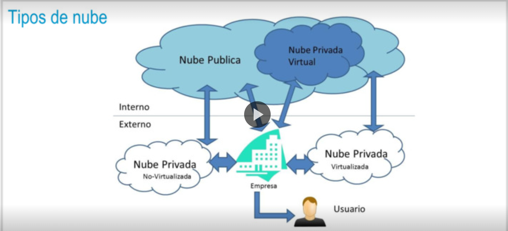

- 
-
-
- ### Comparativa
- CLOUD PRIVADO
  • Mejora la operación IT interna
  • Mejoras modestas en costes
  • Escalabilidad y flexibilidad limitadas
  • Riesgo de obsolescencia
  • Gestión limitada de picos de demanda.
  • Proyectos a medida (Cloud Expertise)
  CLOUD HIBRIDO
  • Mix de los anteriores
  • Incertidumbres sobre calidad
  • Incertidumbres sobre seguridad
  • Adecuado en escenarios de desbordamiento y poco críticos.
  • Proyectos a medida (Cloud Expertise)
  
  CLOUD PÚBLICO
  • Mayor escala, costes más bajos
  • Dificil integración con 'Legacy'
  • Incertidumbres sobre calidad y seguridad
  • Mayor nivel de autogestión
  • Modular y escalable