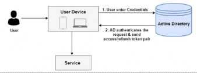
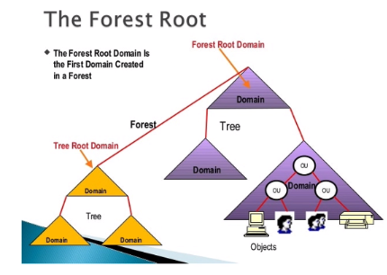

- Es un servicio de directorio para redes de equipos Windows. Desde Windows Server 2000, cualquier equipo
  id:: 666619f2-5a4b-4d99-a43c-f752f36e6327
  puede actuar como controlador de dominio. El AD se usa para tareas de administración centralizadas.
  Un controlador de dominio autentica y autoriza a todos los usuarios y equipos de un dominio y les aplica las políticas de seguridad.
  Utiliza varios protocolos:
  * DNS para identificar dominios y equipos miembros.
  * LDAP para alojar la información de las cuentas de máquinas y de usuario. 
  * Kerberos es el sistema de autenticación y autorización entre equipos.
- {:height 250, :width 522}
- • EI AD es como una BD administrativa con una estructura jerárquica formada por objetos, dominio,
  árboles y bosques.
- #### Objetos
  • Son los elementos básicos del dominio: un ordenador, los servidores de aplicaciones, carpetas
  compartidas, etc. Cada objeto tiene un identificador único y un conjunto de atributos. Se pueden
  organizar en carpetas o en unidades organizativas (OU), que permitirá aplicar políticas de seguridad.
- #### Dominios
  • Es un área de la red que tiene una única BD de autenticación. Sirve para establecer limites
  administrativos entre diferentes grupos de red.
  • Cada dominio, al menos, tendrá un controlador de dominio que es el responsable de los permisos de los objetos, la autenticación y la actualización de los objetos.
- #### Dominios
  • Cada objeto solo puede pertenecer a un dominio.
  • Los dominios se identifican con un nombre DNS (un dominio necesita de un servicio DNS asociado).
  • Los dominios siguen una estructura de árbol, de tal manera que un dominio padre puede ser ejemp1o. 10c  y un hijo hijo.ejemplo.loc. Un miembro de ese dominio podría ser carlos. ejemplo. 10c.
- #### Bosques
  • Los árboles de directorios se organizan en bosques. Estos son el límite administrativo y de seguridad más amplio en una estructura AD.
  • Es posible conectar bosques con una relación de confianza.
-
- {:height 447, :width 634}
-
- #### Sitios
  • Sirve para administrar organizaciones con diferentes localizaciones físicas (sucursales, oficinas, etc.) y que caen en el mismo dominio.
  • Son agrupaciones físicas de subredes.
- #### Sincronizacion de AD
  • Los objetos de un dominio se mantienen en una base de datos replicada y distribuida. Cada controlador
  de dominio contiene una copia de todos los objetos del dominio y puede servir prácticamente para todas
  las operaciones de AD.
  • Cualquier cambio en un objeto realizado en un controlador de dominio
  se transferirá automáticamente a las réplicas en los otros DC.
-
-