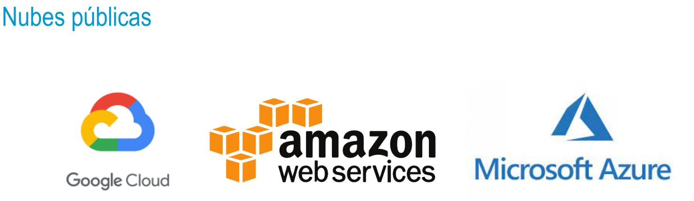

## Nube pública
- • Los usuarios acceden a los servicios de manera compartida sin que exista un exhaustivo control sobr
  la ubicación de la información, que reside en los servidores del proveedor.
  • Cuando hablamos de nube pública queremos decir que toda la infraestructura de computación se
  encuentra en las instalaciones de una empresa de cloud computing que ofrece el servicio en la nube.\
- 
-